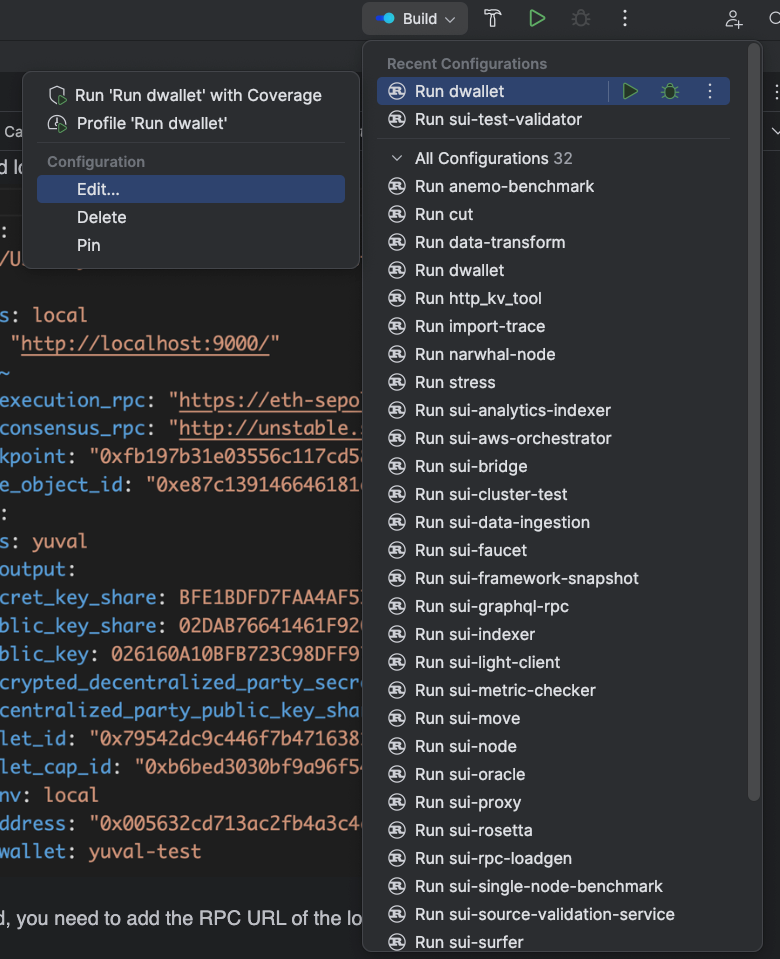

# How to debug dwallet-network CLI

## Preliminary Notes

- **Snapshotting Framework Changes:** Whenever you modify the network—be it through the addition of a module or alteration of an existing module's functionality or state—it's crucial to capture the updated framework state.  
 This step ensures that any changes made to the network's structure are recorded and preserved.
Accomplish this by executing the following command in your terminal, ensuring your current directory is dwallet-network:  
 
```bash
 cargo run --bin sui-framework-snapshot
 ```
- **Building the dwallet Binary:** Communication with the CLI necessitates a built dwallet binary. Build it using the below command in the terminal, with dwallet-network as your current directory:
 ```bash
 cargo build --bin dwallet
 ```
- **Accessing the Binary:** After building the binary, navigate to the target/debug directory to use it:
 ```bash
 cd target/debug
 ```

## Running a Local network:
#### Starting the network
To initiate the network, run the following command. Then, ensure the dwallet client CLI is connected to your local network as per the instructions found [Here](https://docs.sui.io/guides/developer/getting-started/local-network#connect-the-sui-client-cli-to-your-local-network).
```bash
RUST_BACKTRACE=1 cargo run --bin sui-test-validator  
```

#### Obtaining Gas from the Faucet
When you run the `sui-test-validator` binary, it will start a faucet server on port 9123.  
You need do send the following HTTP request for getting gas from faucet:

```bash
curl --location --request POST 'http://127.0.0.1:9123/gas' \
--header 'Content-Type: application/json' \
--data-raw '{
    "FixedAmountRequest": {
        "recipient": "0x005632cd713ac2fb4a3c4ca28f8d985a1b4ff6ad851844bb76a05d2dee6942e8"
    }
}'
```

#### Create a new dWallet
**Important Considerations:**

- Each network initialization necessitates the creation of a new dWallet, as the network does not retain state across sessions.
- Occasionally, the creation command may freeze; if this occurs, simply rerun the command.  

Ensure you record the `dwallet_id` and `dwallet_cap_id` generated, as they are needed for subsequent operations:
```bash
./dwallet client dwallet create --alias <ALIAS> --gas-budget 200000109
```

For example:
```
./dwallet client dwallet create --alias yuval --gas-budget 200000109

╭─────────────────────────────────────────────────────────────────────────────────────╮
│ Created new dwallet and saved its secret share.                                     │
├────────────────┬────────────────────────────────────────────────────────────────────┤
│ alias          │ yuval                                                              │
│ dwallet_id     │ 0x79542dc9c446f7b47163817bebb04546344166e25041787b77227af092734009 │
│ dwallet_cap_id │ 0xb6bed3030bf9a96f54a96582358f19afb7bd74d5142bb9f51ed217aedc9bc3fd │
╰────────────────┴────────────────────────────────────────────────────────────────────╯
```


#### Connecting dWallet to an Ethereum Contract
Take the `dwallet_cap_id` from the previous command and use it in the following command.  
You also need to provide: 
- The smart contract address (on the relevant ETH network) 
- The approved transactions slot number from the compilation info of the contract, under `Storage Layout` section.

Make sure you keep the `Object ID` of the created `EthDwalletCap` object, as you will need it on the next steps.
```
./dwallet client dwallet-connect-eth --dwallet-cap-id "0xb6bed3030bf9a96f54a96582358f19afb7bd74d5142bb9f51ed217aedc9bc3fd" --smart-contract-address "0xff44cF86De919869F053D6Db3b44002c7F0eB63A" --smart-contract-approved-tx-slot "1" --gas-budget 20000000
```

Example response:

```
╭──────────────────────────────────────────────────────────────────────────────────────────────────╮
│ Object Changes                                                                                   │
├──────────────────────────────────────────────────────────────────────────────────────────────────┤
│                                                                                                  │
│ Created Objects:                                                                                 │
│  ┌──                                                                                             │
│  │ ObjectID: 0xfc1e5d45bdd2ca74425b3345950b8fc5acd6615033dd58b6d92f51aa2431a667                  │
│  │ Sender: 0x005632cd713ac2fb4a3c4ca28f8d985a1b4ff6ad851844bb76a05d2dee6942e8                    │
│  │ Owner: Shared                                                                                 │
│  │ ObjectType: 0x3::eth_dwallet::EthDWalletCap                                                   │
│  │ Version: 10                                                                                   │
│  │ Digest: 8Mpvbgp6dircpXVXSzpaPRRVx2K8vgizi9bzUiv7W6ej                                          │
│  └──                                                                                             │
│                                                                                                  │
│ Mutated Objects:                                                                                 │
│  ┌──                                                                                             │
│  │ ObjectID: 0x1daeeb42c9801ed91712b8040ee9282ba5f6486574b6a97e67e67e923ffef209                  │
│  │ Sender: 0x005632cd713ac2fb4a3c4ca28f8d985a1b4ff6ad851844bb76a05d2dee6942e8                    │
│  │ Owner: Account Address ( 0x005632cd713ac2fb4a3c4ca28f8d985a1b4ff6ad851844bb76a05d2dee6942e8 ) │
│  │ ObjectType: 0x2::coin::Coin<0x2::dwlt::DWLT>                                                  │
│  │ Version: 10                                                                                   │
│  │ Digest: 4o3wHKPyPEfFrsCbAxTXbMf5iGMHtsaVPBe32hv8ffWG                                          │
│  └──                                                                                             │
╰──────────────────────────────────────────────────────────────────────────────────────────────────╯
╭───────────────────────────────────────────────────────────────────────────────────────────────────╮
│ Balance Changes                                                                                   │
├───────────────────────────────────────────────────────────────────────────────────────────────────┤
│  ┌──                                                                                              │
│  │ Owner: Account Address ( 0x005632cd713ac2fb4a3c4ca28f8d985a1b4ff6ad851844bb76a05d2dee6942e8 )  │
│  │ CoinType: 0x2::dwlt::DWLT                                                                      │
│  │ Amount: -1714704                                                                               │
│  └──                                                                                              │
╰───────────────────────────────────────────────────────────────────────────────────────────────────╯
```


#### Create first ETH State
The light client uses the EthState object to communicate with the Ethereum network.
On a new network, we need to create a new EthState object, which has a checkpoint included in it.  
This will be used in order to get the state updates from the Ethereum network, and update the `CurrentEthState` object in the network (should be a singleton).  
- Make sure you keep the `Object ID` of the created `EthState` object, as you will need it later on. 
- Modify `last_checkpoint` field inside the json string argument, to be any checkpoint from the last 2 weeks.
- You can get an updated checkpoint for HOLESKY testnet from the following link (Block Root):
https://beaconstate-holesky.chainsafe.io/
```
./dwallet client call --package 0x0000000000000000000000000000000000000000000000000000000000000003 --module eth_dwallet --function create_eth_state --gas-budget 20000000 --args '"{\"last_checkpoint\":\"0x362b9c3d7b783f1250510c95c0693403ff23b81136c415f8b127ba64d7312b29\"}"' 0
```

Example response:
```
╭──────────────────────────────────────────────────────────────────────────────────────────────────╮
│ Object Changes                                                                                   │
├──────────────────────────────────────────────────────────────────────────────────────────────────┤
│                                                                                                  │
│ Created Objects:                                                                                 │
│  ┌──                                                                                             │
│  │ ObjectID: 0xe87c139146646181e2940fcee5108bfb3ab7b1036a20d92e9f72fe4f9192cf9a                  │
│  │ Sender: 0x005632cd713ac2fb4a3c4ca28f8d985a1b4ff6ad851844bb76a05d2dee6942e8                    │
│  │ Owner: Immutable                                                                              │
│  │ ObjectType: 0x3::eth_dwallet::EthState                                                        │
│  │ Version: 11                                                                                   │
│  │ Digest: CjKnYw2iQ9psC5RixYB55JSpHGaeWwoorABbRrjASGfC                                          │
│  └──                                                                                             │
│                                                                                                  │
│ Mutated Objects:                                                                                 │
│  ┌──                                                                                             │
│  │ ObjectID: 0x1daeeb42c9801ed91712b8040ee9282ba5f6486574b6a97e67e67e923ffef209                  │
│  │ Sender: 0x005632cd713ac2fb4a3c4ca28f8d985a1b4ff6ad851844bb76a05d2dee6942e8                    │
│  │ Owner: Account Address ( 0x005632cd713ac2fb4a3c4ca28f8d985a1b4ff6ad851844bb76a05d2dee6942e8 ) │
│  │ ObjectType: 0x2::coin::Coin<0x2::dwlt::DWLT>                                                  │
│  │ Version: 11                                                                                   │
│  │ Digest: GnoQdwiNPyakFHaoK1jd1HL74gmGaDbfbpPc29LMy6sv                                          │
│  └──                                                                                             │
╰──────────────────────────────────────────────────────────────────────────────────────────────────╯
╭───────────────────────────────────────────────────────────────────────────────────────────────────╮
│ Balance Changes                                                                                   │
├───────────────────────────────────────────────────────────────────────────────────────────────────┤
│  ┌──                                                                                              │
│  │ Owner: Account Address ( 0x005632cd713ac2fb4a3c4ca28f8d985a1b4ff6ad851844bb76a05d2dee6942e8 )  │
│  │ CoinType: 0x2::dwlt::DWLT                                                                      │
│  │ Amount: -3084680                                                                               │
│  └──                                                                                              │
╰───────────────────────────────────────────────────────────────────────────────────────────────────╯

```

### Update the dWallet binary client's configuration
On the first run of the `dwallet` binary, it will create a configuration file:
```
~/.dwallet/dwallet_config/client.yaml
```
#### Config file example
The config should look something like this:

- In `rpc` field, you need to add the RPC URL of the local sui-test-validator network you are running.  
It should be `http://localhsot:9000/`, unless you changed the port in the network's configuration.

- In `eth_execution_rpc` field, you need to add the RPC URL of the Ethereum network you use. You can use Alchemy or Infura for that.
- In `eth_consensus_rpc` field, you need to add the Consensus RPC URL of the Ethereum network you use.  
You can use the [Ethereum Beacon Chain checkpoint sync endpoints](https://eth-clients.github.io/checkpoint-sync-endpoints/) for any other network's Consensus RPCs providers.
- `checkpoint` field is the checkpoint that is provided by the user. Typically, it should be the latest checkpoint from the Ethereum network.
- `state_object_id` is the current `EthState` object ID that is used to fetch the current state, which is used for getting the relevant updates from the Ethereum network.
- `dwallets` section is created when you first create a dwallet. It also contains the dwallet_id and the dwallet_cap_id of the dwallet.
  
#### Updating the config file
After you created the `EthState` object, you need to update the `client.yaml` file with the relevant information you got from the previous steps.

The fields you need to update are:
- `checkpoint` - a checkpoint from the Ethereum network(should be the latest one).
- `state_object_id` - the `Object ID` of the `EthState` object you created in the previous step.
   

### Debug the CLI
First, you need to go to your IDE and `cargo build` the whole project.
After this, you will have a list of Debugging configurations in your IDE.
In order to debug the dwallet cli binary, you need to choose the `Run dwallet` configuration, but first we need to add the command we want to debug to the configuration as run arguments.
Perform the following steps to take so:
1. Go to the debug configuration of the `dwallet` binary 
2. `Commands` field should contain the following command. Pay attention to the parameters that you need to provide: `ETH_DWALLET_CAP_ID`, `DWALLET_ID`, `MESSAGE`, `GAS_BUDGET`.:
```
run --package sui --bin dwallet -- client dwallet-eth-verify --eth-dwallet-cap-id "<ETH_DWALLET_CAP_ID>" --dwallet-id "<DWALLET_ID>" --message "<MESSAGE>" --gas-budget 200000000
```

3. Click `Apply`
4. Set relevant breakpoints in the code and click `Debug` to start the debugging session.
