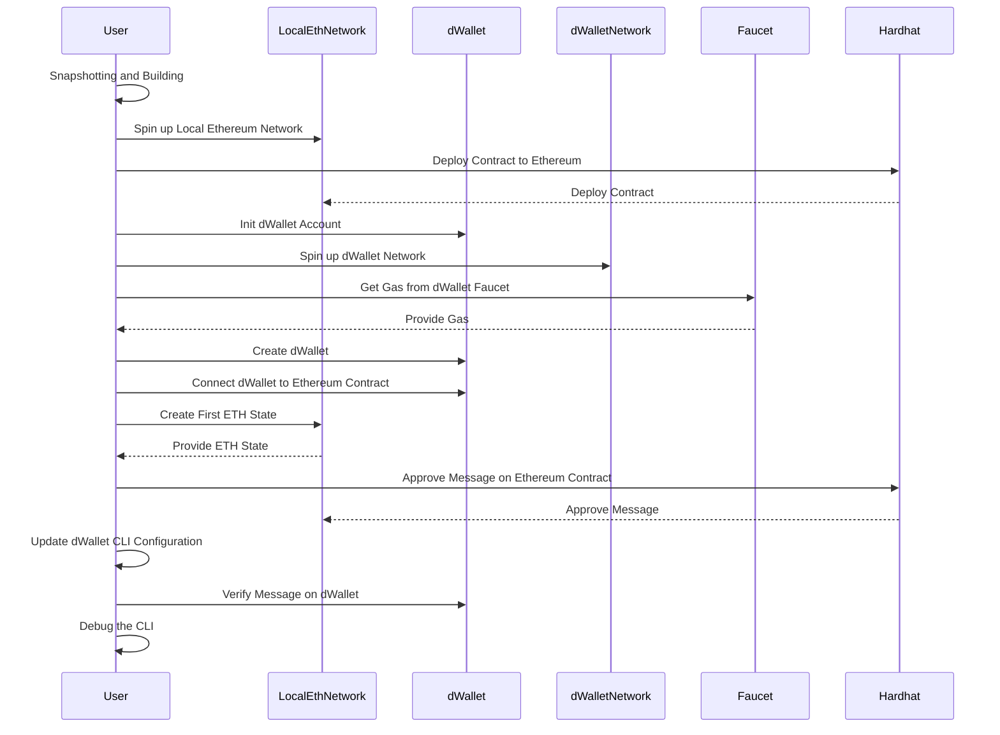
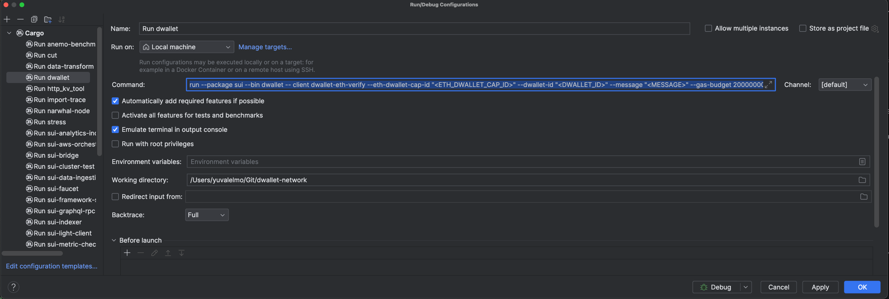

# How to debug Ethereum Light Client functionality with dWallet
## High-Level Review


## Preliminary Notes

- **Snapshotting Framework Changes:** Whenever you modify the network (.move files) —be it through the addition of a module or
  alteration of an existing module's functionality or state—it's crucial to capture the updated framework state.  
  This step ensures that any changes made to the network's structure are recorded and preserved.
  Do this by executing the following command in your terminal, ensuring your current directory is
  dwallet-network:

```bash
 cargo run --bin sui-framework-snapshot
 ```

- **Building the dwallet Binary:** Communication with the CLI requires a built dwallet binary. Build it using the
  below command in the terminal, with dwallet-network as your root directory:

 ```bash
 cargo build --bin dwallet
 ```

- **Accessing the Binary:** After building the binary, navigate to the target/debug directory to use it:

 ```bash
 cd target/debug
 ```

- **Fill In the Blanks:** During the setup of Ethereum Light Client functionality with dWallet, you will need to
  preserve and reuse a few data fields. Some of these fields will be displayed through the terminal, while others will
  come from configuration files. This process can be a bit confusing, so it is recommended to copy and fill in the
  blanks using the following pattern:

```text
- Ethereum Contract Address : ## Terminal output
- Dwallet Id : ## Terminal output
- Dwallet Cap ID : ## Terminal output
- Approved Tx Slot : ## Terminal output
- Eth-Dwallet Cap Id : ## Terminal output
- Eth Chain Id : ## eth-pos-devnet/genesis.json
- Eth Genesis Time : ## Terminal output
- Eth Genesis Validators Root : ## Terminal output
- Beacon Checkpoint : ## Terminal output
```

## Initialize Work Environment

Before we begin working lets initialize our workspace:

### Installations

**Solidity**

```bash
brew tap ethereum/ethereum
brew install solidity
```

**GitHub Credential**

```bash
brew install gh
brew install --cask git-credential-manager
gh auth login #choose Https 
```

**Docker**  
Install Docker Desktop from [here](https://docs.docker.com/desktop/install/mac-install/).  
Also, make sure you have `docker-compose` installed

```bash
brew install docker-compose
```

## Running a Local Ethereum Network

To run a local Ethereum network,
follow the instructions in
the [Ethereum Light Client documentation](https://github.com/dwallet-labs/light-client-test/blob/main/private-ethereum-network-guid.md)
made by our beloved Shay Malichi.   

> **Note 1:** Make sure that the smart contract is deployed to the Ethereum network, before starting the local dWallet network.
> More information about this process can be found in [this section of the document](#Deploy-and-Interact-with-the-Contract).


> **Note 2:** Before starting the local eth, you need to modify the `eth-pos-devnet/docker-compose.yml` file to use stable versions for `beacon-chain` and `validator`, and add the light-client flag.  
> Earlier versions of the image do not have support in light client protocol.
> ```dockerfile
> #From:
>   beacon-chain: # or validator
>      image: "gcr.io/prysmaticlabs/prysm/beacon-chain:v4.1.1"
> #To:
>   beacon-chain: # or validator
>      image: "gcr.io/prysmaticlabs/prysm/beacon-chain:stable" # change image version only 
>      command:
>       - --enable-lightclient  # add this flag only to beacon-chain
> ```

  


## Running a Local dWallet network:

#### Init a new dWallet network account.

To initiate the network, run the following command:
```bash
./dwallet genesis
```

This will create a local client configuration file in `~/.dwallet/dwallet_config/client.yaml` that you can modify to
connect to your local network.
Also, it will create a configuration for four validators and one full node.

#### Starting the network

Before you start the network, configure the dwallet client CLI to connect to your local
network as per the instructions
found [in Sui documentation](https://docs.sui.io/guides/developer/getting-started/local-network#connect-the-sui-client-cli-to-your-local-network).

Then execute the following command in the terminal after the configuration is updated:
```bash
RUST_BACKTRACE=1 cargo run --bin sui-test-validator  
```

#### Obtaining Gas from the Faucet

When you run the `sui-test-validator` binary, it will start a faucet server on port 9123.
To get gas from the faucet, you need to send an HTTP request to the faucet server.
To get your active address for the network, run the following command:

```bash
./dwallet client active-address               
# Example output: 0xfa9b290991fe44ebba08a596c9cac52dcd473239d55d825f547890aa63719515
```

You need to send the following HTTP request for getting gas from the faucet:

```bash
# In the recipient field, you need to provide the active address you got from the previous command.
# In this example we use 0xfa9b290991fe44ebba08a596c9cac52dcd473239d55d825f547890aa63719515
curl --location --request POST 'http://127.0.0.1:9123/gas' \
--header 'Content-Type: application/json' \
--data-raw '{
    "FixedAmountRequest": {
        "recipient": "0xfa9b290991fe44ebba08a596c9cac52dcd473239d55d825f547890aa63719515"
    }
}'
```

#### Create a new dWallet

**Important Considerations:**

- For every dWallet network you start, the creation of a new dWallet is necessary, as the network does not retain state across
  sessions.
- Occasionally, the dWallet creation command may freeze; if this occurs, rerun the command.

Ensure you record the `dwallet_id` and `dwallet_cap_id` generated, as they are needed for subsequent operations:

```bash
./dwallet client dwallet create --alias <ALIAS> --gas-budget 2000000000
```

For example:

```bash
./dwallet client dwallet create --alias yuval --gas-budget 2000000000

#╭─────────────────────────────────────────────────────────────────────────────────────╮
#│ Created new dwallet and saved its secret share.                                     │
#├────────────────┬────────────────────────────────────────────────────────────────────┤
#│ alias          │ foo                                                                │
#│ dwallet_id     │ 0xbe344ddffaa7a8c9c5ae7f2d09a77f20ed54f93bf5e567659feca5c3422ae7a6 │
#│ dwallet_cap_id │ 0x86aed9374e0872250fb8679ced9796eb966af44cecff8e029381174ee26491f9 │
#╰────────────────┴────────────────────────────────────────────────────────────────────╯
```

#### Connecting dWallet to an Ethereum Contract

In this step, you will connect the dWallet to the Ethereum contract.
This is done by creating an `EthDWalletCap` object that links the dWallet to the Ethereum contract that controls it.

Take the `dwallet_cap_id` from the previous command and use it in the following command.  
You also need to provide:

- The smart contract address (you get it when you deploy the contract)
- The approved transactions map's slot number in the contract's state.  
 To get the slot number, execute the following command in the terminal (storage_slot is the slot number):

```bash
npx hardhat check
# ┌──────────────────────┬───────────────────────────┬──────────────┬────────┬────────────────────────────────┬─────┬───────────────────────────────────────────────────┬───────────────┐
# │       contract       │      state_variable       │ storage_slot │ offset │              type              │ idx │                     artifact                      │ numberOfBytes │
# ├──────────────────────┼───────────────────────────┼──────────────┼────────┼────────────────────────────────┼─────┼───────────────────────────────────────────────────┼───────────────┤
# │ dWalletAuthenticator │    authorizedAccounts     │      0       │   0    │  t_mapping(t_address,t_bool)   │  0  │ /build-info/3ca52561f021536875a8e860d57d12bb.json │      32       │
# │ dWalletAuthenticator │ authenticatedTransactions │      1       │   0    │ t_mapping(t_bytes32,t_bytes20) │  0  │ /build-info/3ca52561f021536875a8e860d57d12bb.json │      32       │
# │ dWalletAuthenticator │      dWalletsOwners       │      2       │   0    │ t_mapping(t_bytes20,t_bytes20) │  0  │ /build-info/3ca52561f021536875a8e860d57d12bb.json │      32       │
# └──────────────────────┴───────────────────────────┴──────────────┴────────┴────────────────────────────────┴─────┴───────────────────────────────────────────────────┴───────────────┘
``` 

Make sure you keep the `Object ID` of the created `EthDwalletCap` object, as you will need it on the next steps.

```bash
./dwallet client dwallet-connect-eth --dwallet-cap-id "0x86aed9374e0872250fb8679ced9796eb966af44cecff8e029381174ee26491f9" --smart-contract-address "0x3e2AabB763F255CbB6a322DBe532192e120B5C6B" --smart-contract-approved-tx-slot "1" --gas-budget 20000000

#╭──────────────────────────────────────────────────────────────────────────────────────────────────╮
#│ Object Changes                                                                                   │
#├──────────────────────────────────────────────────────────────────────────────────────────────────┤
#│                                                                                                  │
#│ Created Objects:                                                                                 │
#│  ┌──                                                                                             │
#│  │ ObjectID: 0x9ac65d90a2a247316b493c2939f6a1ecf83bbf3d202fb8ea2303399114e007d2                  │
#│  │ Sender: 0x005632cd713ac2fb4a3c4ca28f8d985a1b4ff6ad851844bb76a05d2dee6942e8                    │
#│  │ Owner: Shared                                                                                 │
#│  │ ObjectType: 0x3::eth_dwallet::EthDWalletCap                                                   │
#│  │ Version: 10                                                                                   │
#│  │ Digest: 8Mpvbgp6dircpXVXSzpaPRRVx2K8vgizi9bzUiv7W6ej                                          │
#│  └──                                                                                             │
#│                                                                                                  │
#│ Mutated Objects:                                                                                 │
#│  ┌──                                                                                             │
#│  │ ObjectID: 0x1daeeb42c9801ed91712b8040ee9282ba5f6486574b6a97e67e67e923ffef209                  │
#│  │ Sender: 0x005632cd713ac2fb4a3c4ca28f8d985a1b4ff6ad851844bb76a05d2dee6942e8                    │
#│  │ Owner: Account Address ( 0x005632cd713ac2fb4a3c4ca28f8d985a1b4ff6ad851844bb76a05d2dee6942e8 ) │
#│  │ ObjectType: 0x2::coin::Coin<0x2::dwlt::DWLT>                                                  │
#│  │ Version: 10                                                                                   │
#│  │ Digest: 4o3wHKPyPEfFrsCbAxTXbMf5iGMHtsaVPBe32hv8ffWG                                          │
#│  └──                                                                                             │
#╰──────────────────────────────────────────────────────────────────────────────────────────────────╯
#╭───────────────────────────────────────────────────────────────────────────────────────────────────╮
#│ Balance Changes                                                                                   │
#├───────────────────────────────────────────────────────────────────────────────────────────────────┤
#│  ┌──                                                                                              │
#│  │ Owner: Account Address ( 0x005632cd713ac2fb4a3c4ca28f8d985a1b4ff6ad851844bb76a05d2dee6942e8 )  │
#│  │ CoinType: 0x2::dwlt::DWLT                                                                      │
#│  │ Amount: -1714704                                                                               │
#│  └──                                                                                              │
#╰───────────────────────────────────────────────────────────────────────────────────────────────────╯
```

#### Init first ETH State
The `LatestEthereumState` object is where we store the latest **verified** Ethereum state.
The light client uses the `LatestEthereumState` object to communicate with the Ethereum network.
After this object is created, you would not need to create it again (unless you shut down the network),
as it will be updated automatically when a newer state is verified.  
After the `LatestEthereumState` object is created, the sui configuration of the current active environment is updated to point to this object.

- In order to create a new `LatestEthereumState` object, you need to provide the finalized block root of the Ethereum network.  
You can achieve this as explained in the [Beacon Checkpoint](#beacon-checkpoint) section.
```bash
./dwallet client init-eth-state --checkpoint "0xc0209e40b6051b3491e8bdac62760f038afa0312b288256ad6e8bdb1580e5e15" --gas-budget 2000000000
#╭──────────────────────────────────────────────────────────────────────────────────────────────────╮
#│ Object Changes                                                                                   │
#├──────────────────────────────────────────────────────────────────────────────────────────────────┤
#│                                                                                                  │
#│ Created Objects:                                                                                 │
#│  ┌──                                                                                             │
#│  │ ObjectID: 0x117b5547fe3fe3df8f68a84e0cbbbdc8a2329ce3b1d90b942691b8ba0688d84c                  │
#│  │ Sender: 0xfa9b290991fe44ebba08a596c9cac52dcd473239d55d825f547890aa63719515                    │
#│  │ Owner: Immutable                                                                              │
#│  │ ObjectType: 0x3::ethereum_state::EthState                                                     │
#│  │ Version: 13                                                                                   │
#│  │ Digest: J6Rh8WSJ7WvsrTYRGK6EaeVwUNiA3rnPaQ2w9AK3zdob                                          │
#│  └──                                                                                             │
#│  ┌──                                                                                             │
#│  │ ObjectID: 0xbc35f943a24fbf984fe8ea84251c800aaad5cd272927d519eed31b92ded86093                  │
#│  │ Sender: 0xfa9b290991fe44ebba08a596c9cac52dcd473239d55d825f547890aa63719515                    │
#│  │ Owner: Shared                                                                                 │
#│  │ ObjectType: 0x3::ethereum_state::LatestEthereumState                                          │
#│  │ Version: 13                                                                                   │
#│  │ Digest: E129VnVuyUrzfVgpS5a8e2fL3jKroHHheJaxmQ4umnhq                                          │
#│  └──                                                                                             │
#│                                                                                                  │
#│ Mutated Objects:                                                                                 │
#│  ┌──                                                                                             │
#│  │ ObjectID: 0x64563f21301154cfa4f7fc870aa935162ec1c5dd9162d714d95a1aab01e6116d                  │
#│  │ Sender: 0xfa9b290991fe44ebba08a596c9cac52dcd473239d55d825f547890aa63719515                    │
#│  │ Owner: Account Address ( 0xfa9b290991fe44ebba08a596c9cac52dcd473239d55d825f547890aa63719515 ) │
#│  │ ObjectType: 0x2::coin::Coin<0x2::dwlt::DWLT>                                                  │
#│  │ Version: 13                                                                                   │
#│  │ Digest: CEcMixXCGaE87P9txWMJERDC4mpK7YZKmMkFNTji7nCH                                          │
#│  └──                                                                                             │
#╰──────────────────────────────────────────────────────────────────────────────────────────────────╯
```

### Update the dWallet binary client's configuration

On the first run of the `dwallet` binary, it will create a configuration file:
```
~/.dwallet/dwallet_config/client.yaml
```

We need to update this file to include the Ethereum network configuration.  
To do this, you need to first get those configurations from the Ethereum network.
#### Get Ethereum Network Configuration

For the light client to work properly with the local ethereum network, you need to provide the **chain ID**, **genesis time**, **genesis
validators root**, and a beacon checkpoint.
You can get the **Chain ID** from the network's execution layer genesis configuration file (should be found in `eth-pos-devnet/execution/genesis.json`).

##### Genesis Time and Genesis Validators Root
To get the **genesis time** and **genesis validators root**, you need to run the following command:

```bash
# Get genesis time and genesis validators root
curl http://localhost:3500/eth/v1/beacon/genesis

# Example response:
#
# {
#  "data": {
#    "genesis_time": "1590832934",
#    "genesis_validators_root": "0xcf8e0d4e9587369b2301d0790347320302cc0943d5a1884560367e8208d920f2",
#    "genesis_fork_version": "0x00000000"
#   }
# }
```
##### Beacon Checkpoint
To get the **beacon checkpoint**, you need to run the following command.
You should take the finalized checkpoint root from the response.

```bash
# Get beacon chain finalized checkpoint
curl http://localhost:3500/eth/v1/beacon/states/finalized/finality_checkpoints
# Example response:
#
#  {
#    "execution_optimistic": false,
#    "finalized": false,
#    "data": {
#      "previous_justified": {
#        "epoch": "1",
#        "root": "0xcf8e0d4e9587369b2301d0790347320302cc0943d5a1884560367e8208d920f2"
#      },
#      "current_justified": {
#        "epoch": "1",
#        "root": "0xcf8e0d4e9587369b2301d0790347320302cc0943d5a1884560367e8208d920f2"
#      },
#      "finalized": {
#        "epoch": "1",
#        "root": "0xcf8e0d4e9587369b2301d0790347320302cc0943d5a1884560367e8208d920f2" // This is what you need
#      }
#    }
#  }
```


#### dWallet client Config file
We will only need to update the `envs` field in the configuration file.
You need to provide the `eth_execution_rpc`, `eth_consensus_rpc`, `eth_chain_id`, `eth_genesis_time`, `eth_genesis_validators_root` and `state_object_id` fields.
##### Example configuration file:
```yaml
keystore:
  File: /Users/yuvalelmo/.dwallet/dwallet_config/dwallet.keystore
envs:
  - alias: localnet # Is the name of the environment.
    rpc: "http://localhost:9000" # Is the rpc url of the local dwallet node, this address is set when initializing dWallet genesis.
    ws: ~
    eth_execution_rpc: "http://localhost:8545" # Is the rpc url of the local ethereum node.
    eth_consensus_rpc: "http://localhost:3500" # Is the consensus rpc url of the local ethereum node.
    eth_chain_id: 32382 # Is the chain id of the local ethereum network.
    eth_genesis_time: 1716207494 # Is the genesis time of the local ethereum network.
    eth_genesis_validators_root: "0x83431ec7fcf92cfc44947fc0418e831c25e1d0806590231c439830db7ad54fda" # Is the genesis validators root of the local ethereum network.
    state_object_id: "0x771541ddb704918927675e4d6f839728d3ace241bd34a67b9b17d6251c75fc2f" # Is the object id of the EthState object that we created in the previous step.
dwallets:
  - alias: foo
    dkg_output:
      secret_key_share: 851A8FE7E6180BAE902DB1B4C7E197D258B7C06999245756697D65F6DC985788
      public_key_share: 02AFE206C8AE6677DD68766D4B424F6E80E404E4B76D77B62D5991511F15618A27
      public_key: 0220A5129BB3FCCEBB9E16F1EF90EFC4C068E25CDFA1A5B5D37EF2EBCFC0DEF78E
      encrypted_decentralized_party_secret_key_share: 9a4194b85ba1ba27c3bfcaea21843b24ed189e62f765233d89e6237e3f7a9bcb2388546cc41ed40f49bc77781c096de58aeeee267a7986609414292cbf66ae7103a8aacdf7a7ae2a67b97e1668cfbbfdc24f52823b134ddfd0198f75ee6f2f83ed26abb8ec3443dd802c4866f6d3183c8cc7741c7953bec22ddb8af0a34ba71f34405dc1c27b9fb42c608211610abdbd3129654a22aef9bcf4db5af1a9d2966cc17b54caa322b11ec9409660d5b8a288f9b5732da23aa5ba370d5247d5457002c023117bb9f4caea4b0d4389941e4e1ade662a58b1e325b53a9c109dd48171a61ec2d507269bdedf2b190caa3ce25b58179a311306c6d5af10feab22092be92df86f0f4edad4ce317e609ad155c688c571c9f2bd30bd12a6515a6291658bdcb4c10662530757bbe85de33013972a3a16c977e04af5a4df580a17e3ab63b01789914e69521459437f93e24e956345701881e7be9c152f765b9d146749a4b1be1b7a6ed2325ac79e809f016ffc7cd6ac0d4775a945343a7272aa4f77356db9ee0ce280035e1f5238a5ab43320f29923bba53b1b7eab562b8daed73bcbbdf7361bdd3bb9c58903394574f926a28b25470674d980b8a70abe1ca71445e4ea0aa09d0cf9494250bea5fe1a14d2c391ee453135aaceebcb31d81da728cc79c696130f105758e73c4af2d09b26367eac5bbe90972e75ef1e3044878ee228064e65dac29
      decentralized_party_public_key_share: 0299D7B0C00F6D243DF6F3A7B2259CAEC741287F2A22B06C150FAD253E61DB9CF8
    dwallet_id: "0xbe344ddffaa7a8c9c5ae7f2d09a77f20ed54f93bf5e567659feca5c3422ae7a6"
    dwallet_cap_id: "0x86aed9374e0872250fb8679ced9796eb966af44cecff8e029381174ee26491f9"
active_env: localnet
active_address: "0xfa9b290991fe44ebba08a596c9cac52dcd473239d55d825f547890aa63719515"
active_dwallet: foo 
```

### Debug the CLI binary

> **Note:** If you only want to execute the dwallet-eth-verify command (**without debugging**), you can use the following command:
> ```bash
> ./dwallet client dwallet-eth-verify --eth-dwallet-cap-id "<ETH_DWALLET_CAP_ID>" --dwallet-id "<DWALLET_ID>" --message "<MESSAGE>" --gas-budget 200000000 --gas "<GAS_OBJECT>"
> ```

To debug the dwallet cli binary, you need to follow the steps below:
1. Create a new configuration in your IDE to run the dwallet binary (this should be a Cargo configuration).
2. Add the command you want to debug to the configuration as run arguments.  
for example, to debug the `dwallet-eth-verify` command of the CLI,
the `Commands` field should contain the following command. Pay attention to the parameters that you need to
   provide: `ETH_DWALLET_CAP_ID`, `DWALLET_ID`, `MESSAGE`, `GAS_BUDGET`, `GAS`:
```bash
run --package sui --bin dwallet -- client dwallet-eth-verify --eth-dwallet-cap-id "<ETH_DWALLET_CAP_ID>" --dwallet-id "<DWALLET_ID>" --message "<MESSAGE>" --gas-budget 200000000
```



3. Enjoy debugging

### Hardhat

To deploy and interact with our contract, we would use the Hardhat framework.
Read the [Hardhat documentation](https://hardhat.org/hardhat-runner/docs/getting-started#installation) to install it.  
Also, you would need to install `@nomicfoundation/hardhat-toolbox` using the command below:
```bash
npm install --save-dev @nomicfoundation/hardhat-toolbox
```

#### HardHat Configuration
First, we would need to init the hardhat project. Run the command below, and navigate through the options using arrow keys to create an empty config.
```bash
npx hardhat init

#  888    888                      888 888               888
#  888    888                      888 888               888
#  888    888                      888 888               888
#  8888888888  8888b.  888d888 .d88888 88888b.   8888b.  888888
#  888    888     "88b 888P"  d88" 888 888 "88b     "88b 888
#  888    888 .d888888 888    888  888 888  888 .d888888 888
#  888    888 888  888 888    Y88b 888 888  888 888  888 Y88b.
#  888    888 "Y888888 888     "Y88888 888  888 "Y888888  "Y888
#  
#  👷 Welcome to Hardhat v2.19.4 👷‍
#  
#  ? What do you want to do? …
#  ❯ Create a JavaScript project
#    Create a TypeScript project
#    Create a TypeScript project (with Viem)
#    Create an empty hardhat.config.js
#    Quit
```

After initializing, `hardhat.config.js` file is created in the root of the project.
You should update the configuration to match the settings of your local Ethereum network.
Example `hardhat.config.js` file:
> **Note:** the `accounts` field in the network configuration should contain the private keys of the accounts you want to use when deploying contracts or interacting with the network.  
> In our case, you can get the private key from `eth-pos-devnet/execution/sk.json` file, in `eth-pos-devnet` repo. 

```javascript
require('@nomicfoundation/hardhat-toolbox')

/** @type import('hardhat/config').HardhatUserConfig */
module.exports = {
    solidity: {
        version: '0.8.24',
        settings: {
            evmVersion: 'cancun',
            optimizer: {
                enabled: true,
                runs: 200
            }
        }
    },
    defaultNetwork: 'hardhat',
    networks: {
        hardhat: {
            accounts: {
                accountsBalance: "1000000000000000000000000"
            }
        },
        holesky: {
            url: "https://ethereum-holesky.blockpi.network/v1/rpc/public",
            accounts: ["0xd44ae2f6b64f6edb6095aebb7e9c7b1f279dc21ce7d966a787df2ee9c6362425"]
        },
        local: {
            url: "http://localhost:8545",
            accounts: ["0x2e0834786285daccd064ca17f1654f67b4aef298acbb82cef9ec422fb4975622"]
        }
    },
}
```

#### Deploy and Interact with the Contract

Once you've installed and configured Hardhat correctly,
you can now compile the contract, run scripts to deploy the contract and interact with it.  
Before we execute any scripts, we need to compile the contract.
This would also generate the ABI for the contract, which we will need for interacting with it.  

The contract should be located in the `contracts` directory of the Hardhat project (where the `hardhat.config.js` is located).  
Read more about compiling a smart contract in
the [Hardhat docs](https://hardhat.org/hardhat-runner/docs/guides/compile-contracts).  

To compile the contract, run the following command:

```bash
npx hardhat compile
```

In order to execute the scripts, you need to run the following command:

```bash
npx hardhat run <script_file_name>.js --network <network_name>
```

Example `deploy.js` script:

```javascript
const hre = require("hardhat");

async function main() {
    const dWalletAuthenticatorFactory = await hre.ethers.getContractFactory("dWalletAuthenticator");
    const dWalletAuthenticator = await dWalletAuthenticatorFactory.deploy();

    await dWalletAuthenticator.waitForDeployment();

    console.log("dWalletAuthenticator deployed to: ", dWalletAuthenticator.target);
}

main()
    .then(() => process.exit(0))
    .catch((error) => {
        console.error(error);
        process.exit(1);
    });
```

Example `interact.js` script:

```javascript
// Import ethers from Hardhat package
const {ethers} = require("hardhat");

async function main() {
    // Your contract's ABI
    const abi = ""; // <ABI GOES HERE>;

    // The address your contract is deployed at
    const contractAddress = "0x3e2aabb763f255cbb6a322dbe532192e120b5c6b";

    // Setup provider and contract instance
    const provider = new ethers.JsonRpcProvider("http://localhost:8545");
    const contract = new ethers.Contract(contractAddress, abi, provider);

    // Create a signer. If you use a local network - get the key from network configuration
    const signer = new ethers.Wallet('2e0834786285daccd064ca17f1654f67b4aef298acbb82cef9ec422fb4975622', provider);

    // Connect your contract to signer
    const contractWithSigner = contract.connect(signer);

    // Authorize the account
    const account = "0x123463a4b065722e99115d6c222f267d9cabb524";
    const tx = await contractWithSigner.accountAuthorize(account);
    console.log("Transaction Hash:", tx.hash);
    await new Promise(r => setTimeout(r, 10000));
  
    // Add dwallet owner
    const dWalletID = "0xbe344ddffaa7a8c9c5ae7f2d09a77f20ed54f93bf5e567659feca5c3422ae7a6";
    let ownerID = "0x123463a4b065722e99115d6c222f267d9cabb524";
    const tx1 = await contractWithSigner.addDWalletOwner(dWalletID, ownerID);
    console.log("Transaction Hash:", tx1.hash);
    await new Promise(r => setTimeout(r, 10000));
  
    // Example function call
    const message = "dGhpcyBpcyB0aGUgZmlyc3QgbWVzc2FnZSB0aGF0IGkgYW0gZ29pbmcgdG8gdmVyaWZ5IG9uIGEgbG9jYWwgZXRoZXJldW0gbmV0d29yaywgdXNpbmcgbGlnaHQgY2xpZW50ICYgZHdhbGxldCBuZXR3b3Jr";
    const tx2 = await contractWithSigner.approveMessage(message, dWalletID, {gasPrice: ethers.parseUnits("10", "gwei")});
    console.log("Transaction Hash:", tx2.hash);
}

main().catch((error) => {
    console.error(error);
    process.exit(1);
});
```

