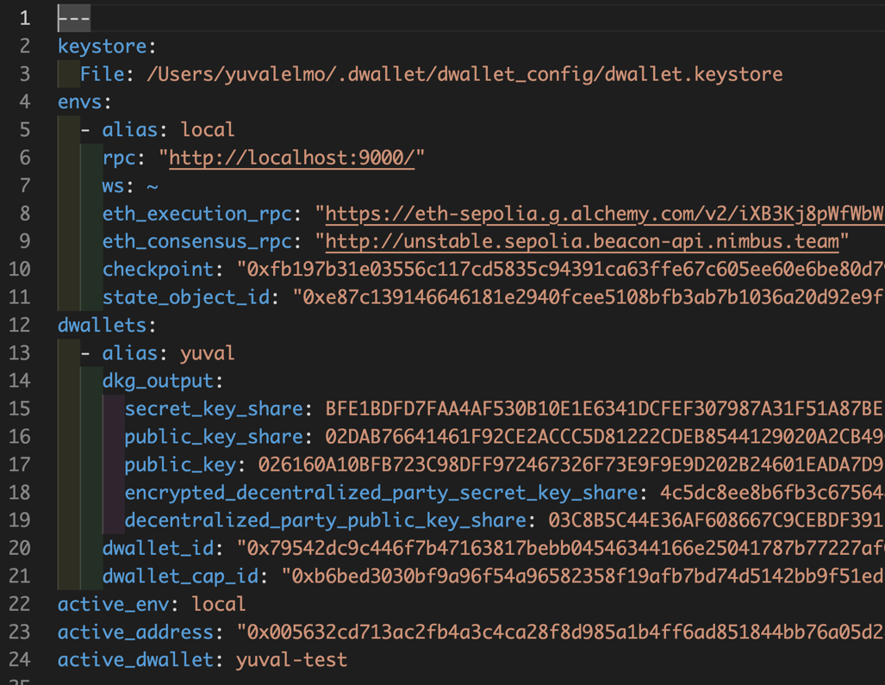

# How to debug Ethereum Light Client functionality with dWallet

## Preliminary Notes

- **Snapshotting Framework Changes:** Whenever you modify the network—be it through the addition of a module or alteration of an existing module's functionality or state—it's crucial to capture the updated framework state.  
 This step ensures that any changes made to the network's structure are recorded and preserved.
Accomplish this by executing the following command in your terminal, ensuring your current directory is dwallet-network:  
 
```bash
 cargo run --bin sui-framework-snapshot
 ```
- **Building the dwallet Binary:** Communication with the CLI necessitates a built dwallet binary. Build it using the below command in the terminal, with dwallet-network as your current directory:
 ```bash
 cargo build --bin dwallet
 ```
- **Accessing the Binary:** After building the binary, navigate to the target/debug directory to use it:
 ```bash
 cd target/debug
 ```

## Running a Local dwallet network:
#### Starting the network
To initiate the network, run the following command. Then, ensure the dwallet client CLI is connected to your local network as per the instructions found [Here](https://docs.sui.io/guides/developer/getting-started/local-network#connect-the-sui-client-cli-to-your-local-network).
```bash
RUST_BACKTRACE=1 cargo run --bin sui-test-validator  
```

#### Obtaining Gas from the Faucet
When you run the `sui-test-validator` binary, it will start a faucet server on port 9123.  
You need do send the following HTTP request for getting gas from faucet:

```bash
curl --location --request POST 'http://127.0.0.1:9123/gas' \
--header 'Content-Type: application/json' \
--data-raw '{
    "FixedAmountRequest": {
        "recipient": "0x005632cd713ac2fb4a3c4ca28f8d985a1b4ff6ad851844bb76a05d2dee6942e8"
    }
}'
```

#### Create a new dWallet
**Important Considerations:**

- Each network initialization necessitates the creation of a new dWallet, as the network does not retain state across sessions.
- Occasionally, the creation command may freeze; if this occurs, simply rerun the command.  

Ensure you record the `dwallet_id` and `dwallet_cap_id` generated, as they are needed for subsequent operations:
```bash
./dwallet client dwallet create --alias <ALIAS> --gas-budget 200000109
```

For example:
```
./dwallet client dwallet create --alias yuval --gas-budget 200000109

╭─────────────────────────────────────────────────────────────────────────────────────╮
│ Created new dwallet and saved its secret share.                                     │
├────────────────┬────────────────────────────────────────────────────────────────────┤
│ alias          │ yuval                                                              │
│ dwallet_id     │ 0x79542dc9c446f7b47163817bebb04546344166e25041787b77227af092734009 │
│ dwallet_cap_id │ 0xb6bed3030bf9a96f54a96582358f19afb7bd74d5142bb9f51ed217aedc9bc3fd │
╰────────────────┴────────────────────────────────────────────────────────────────────╯
```


#### Connecting dWallet to an Ethereum Contract
Take the `dwallet_cap_id` from the previous command and use it in the following command.  
You also need to provide: 
- The smart contract address (on the relevant ETH network) 
- The approved transactions slot number from the compilation info of the contract, under `Storage Layout` section.

Make sure you keep the `Object ID` of the created `EthDwalletCap` object, as you will need it on the next steps.
```
./dwallet client dwallet-connect-eth --dwallet-cap-id "0xb6bed3030bf9a96f54a96582358f19afb7bd74d5142bb9f51ed217aedc9bc3fd" --smart-contract-address "0xff44cF86De919869F053D6Db3b44002c7F0eB63A" --smart-contract-approved-tx-slot "1" --gas-budget 20000000
```

Example response:

```
╭──────────────────────────────────────────────────────────────────────────────────────────────────╮
│ Object Changes                                                                                   │
├──────────────────────────────────────────────────────────────────────────────────────────────────┤
│                                                                                                  │
│ Created Objects:                                                                                 │
│  ┌──                                                                                             │
│  │ ObjectID: 0xfc1e5d45bdd2ca74425b3345950b8fc5acd6615033dd58b6d92f51aa2431a667                  │
│  │ Sender: 0x005632cd713ac2fb4a3c4ca28f8d985a1b4ff6ad851844bb76a05d2dee6942e8                    │
│  │ Owner: Shared                                                                                 │
│  │ ObjectType: 0x3::eth_dwallet::EthDWalletCap                                                   │
│  │ Version: 10                                                                                   │
│  │ Digest: 8Mpvbgp6dircpXVXSzpaPRRVx2K8vgizi9bzUiv7W6ej                                          │
│  └──                                                                                             │
│                                                                                                  │
│ Mutated Objects:                                                                                 │
│  ┌──                                                                                             │
│  │ ObjectID: 0x1daeeb42c9801ed91712b8040ee9282ba5f6486574b6a97e67e67e923ffef209                  │
│  │ Sender: 0x005632cd713ac2fb4a3c4ca28f8d985a1b4ff6ad851844bb76a05d2dee6942e8                    │
│  │ Owner: Account Address ( 0x005632cd713ac2fb4a3c4ca28f8d985a1b4ff6ad851844bb76a05d2dee6942e8 ) │
│  │ ObjectType: 0x2::coin::Coin<0x2::dwlt::DWLT>                                                  │
│  │ Version: 10                                                                                   │
│  │ Digest: 4o3wHKPyPEfFrsCbAxTXbMf5iGMHtsaVPBe32hv8ffWG                                          │
│  └──                                                                                             │
╰──────────────────────────────────────────────────────────────────────────────────────────────────╯
╭───────────────────────────────────────────────────────────────────────────────────────────────────╮
│ Balance Changes                                                                                   │
├───────────────────────────────────────────────────────────────────────────────────────────────────┤
│  ┌──                                                                                              │
│  │ Owner: Account Address ( 0x005632cd713ac2fb4a3c4ca28f8d985a1b4ff6ad851844bb76a05d2dee6942e8 )  │
│  │ CoinType: 0x2::dwlt::DWLT                                                                      │
│  │ Amount: -1714704                                                                               │
│  └──                                                                                              │
╰───────────────────────────────────────────────────────────────────────────────────────────────────╯
```


#### Create first ETH State
The light client uses the EthState object to communicate with the Ethereum network.
On a new network, we need to create a new EthState object, which has a checkpoint included in it.  
This will be used in order to get the state updates from the Ethereum network, and update the `CurrentEthState` object in the network (should be a singleton).  
- Make sure you keep the `Object ID` of the created `EthState` object, as you will need it later on. 
- Modify `last_checkpoint` field inside the json string argument, to be any checkpoint from the last 2 weeks.
- You can get an updated checkpoint for HOLESKY testnet from the following link (Block Root):
https://beaconstate-holesky.chainsafe.io/
```
./dwallet client call --package 0x0000000000000000000000000000000000000000000000000000000000000003 --module eth_dwallet --function create_eth_state --gas-budget 20000000 --args '"{\"last_checkpoint\":\"0x362b9c3d7b783f1250510c95c0693403ff23b81136c415f8b127ba64d7312b29\"}"' 0
```

Example response:
```
╭──────────────────────────────────────────────────────────────────────────────────────────────────╮
│ Object Changes                                                                                   │
├──────────────────────────────────────────────────────────────────────────────────────────────────┤
│                                                                                                  │
│ Created Objects:                                                                                 │
│  ┌──                                                                                             │
│  │ ObjectID: 0xe87c139146646181e2940fcee5108bfb3ab7b1036a20d92e9f72fe4f9192cf9a                  │
│  │ Sender: 0x005632cd713ac2fb4a3c4ca28f8d985a1b4ff6ad851844bb76a05d2dee6942e8                    │
│  │ Owner: Immutable                                                                              │
│  │ ObjectType: 0x3::eth_dwallet::EthState                                                        │
│  │ Version: 11                                                                                   │
│  │ Digest: CjKnYw2iQ9psC5RixYB55JSpHGaeWwoorABbRrjASGfC                                          │
│  └──                                                                                             │
│                                                                                                  │
│ Mutated Objects:                                                                                 │
│  ┌──                                                                                             │
│  │ ObjectID: 0x1daeeb42c9801ed91712b8040ee9282ba5f6486574b6a97e67e67e923ffef209                  │
│  │ Sender: 0x005632cd713ac2fb4a3c4ca28f8d985a1b4ff6ad851844bb76a05d2dee6942e8                    │
│  │ Owner: Account Address ( 0x005632cd713ac2fb4a3c4ca28f8d985a1b4ff6ad851844bb76a05d2dee6942e8 ) │
│  │ ObjectType: 0x2::coin::Coin<0x2::dwlt::DWLT>                                                  │
│  │ Version: 11                                                                                   │
│  │ Digest: GnoQdwiNPyakFHaoK1jd1HL74gmGaDbfbpPc29LMy6sv                                          │
│  └──                                                                                             │
╰──────────────────────────────────────────────────────────────────────────────────────────────────╯
╭───────────────────────────────────────────────────────────────────────────────────────────────────╮
│ Balance Changes                                                                                   │
├───────────────────────────────────────────────────────────────────────────────────────────────────┤
│  ┌──                                                                                              │
│  │ Owner: Account Address ( 0x005632cd713ac2fb4a3c4ca28f8d985a1b4ff6ad851844bb76a05d2dee6942e8 )  │
│  │ CoinType: 0x2::dwlt::DWLT                                                                      │
│  │ Amount: -3084680                                                                               │
│  └──                                                                                              │
╰───────────────────────────────────────────────────────────────────────────────────────────────────╯

```

### Update the dWallet binary client's configuration
On the first run of the `dwallet` binary, it will create a configuration file:
```
~/.dwallet/dwallet_config/client.yaml
```
#### Config file example
The config should look something like this:


- In `rpc` field, you need to add the RPC URL of the Sui network you are running.  
If you use a local sui node the RPC should be `http://localhsot:9000/`,
  unless you changed the port in the network's configuration.

- In `eth_execution_rpc` field, you need to add the RPC URL of the Ethereum network you use.   
If you debug against a local ethereum network, the default URL would be `http://localhost:8545/`. If you use Ethereum testnet, you can use Alchemy or Infura for that.
- In `eth_consensus_rpc` field, you need to add the Consensus RPC URL of the Ethereum network you use. For local Ethereum this would be `http://localhost:3500/`.  
You can use the [Ethereum Beacon Chain checkpoint sync endpoints](https://eth-clients.github.io/checkpoint-sync-endpoints/) for any other network's Consensus RPCs providers.
- `state_object_id` is the current `EthState` object ID that is used to fetch the current state, which is used for getting the relevant updates from the Ethereum network.

**Note:** When using local ethereum network, you should also provide `eth_genesis_time`, `eth_genesis_validators_root`, and `eth_chain_id` fields in the config file.
See how to get these values in the end of this document. []

#### Updating the config file
After you created the `EthState` object, you need to update the `client.yaml` file with the Object ID you got from the previous steps. 

### Debug the CLI
First, you need to go to your IDE and `cargo build` the whole project.
After this, you will have a list of Debugging configurations in your IDE.
To debug the dwallet cli binary, you need to choose the `Run dwallet` configuration, but first we need to add the command we want to debug to the configuration as run arguments.
Perform the following steps to take so:
1. Go to the debug configuration of the `dwallet` binary
2. `Commands` field should contain the following command. Pay attention to the parameters that you need to provide: `ETH_DWALLET_CAP_ID`, `DWALLET_ID`, `MESSAGE`, `GAS_BUDGET`. Sometimes you will need to provide a gas object ID as well. :
```
run --package sui --bin dwallet -- client dwallet-eth-verify --eth-dwallet-cap-id "<ETH_DWALLET_CAP_ID>" --dwallet-id "<DWALLET_ID>" --message "<MESSAGE>" --gas-budget 200000000
```

3. Enjoy debugging


## Using Local Ethereum Network
To run a local Ethereum network,
follow the instructions in the [Ethereum Light Client documentation](https://github.com/dwallet-labs/light-client-test/blob/main/private-ethereum-network-guid.md) made by our beloved Shay Malichi.
After you have a local Ethereum network running, you want to deploy the contract and execute some functions in it,
to approve the message you want to verify in the dwallet.

### Hardhat
To deploy and interact with our contract, we would use the Hardhat framework.
Read the [Hardhat documentation](https://hardhat.org/hardhat-runner/docs/getting-started#installation) to install it.

#### HardHat Configuration
Hardhat configuration is taken from the `hardhat.config.js` file in the root of the project.
You should update the configuration to match the settings of your local Ethereum network.
Example `hardhat.config.js` file:
```javascript
require('dotenv').config()
require('@nomicfoundation/hardhat-toolbox')
// Plugin for storage and slots.
require('hardhat-storage-layout')

/** @type import('hardhat/config').HardhatUserConfig */
module.exports = {
    solidity: {
        version: '0.8.24',
        settings: {
            evmVersion: 'cancun',
            optimizer: {
                enabled: true,
                runs: 200
            }
        }
    },
    defaultNetwork: 'hardhat',
    networks: {
        hardhat: {
            accounts: {
                accountsBalance: "1000000000000000000000000"
            }
        },
        holesky: {
            url: "https://ethereum-holesky.blockpi.network/v1/rpc/public",
            accounts: ["0xd44ae2f6b64f6edb6095aebb7e9c7b1f279dc21ce7d966a787df2ee9c6362425"]
        },
        local: {
            url: "http://localhost:8545",
            accounts: ["0x2e0834786285daccd064ca17f1654f67b4aef298acbb82cef9ec422fb4975622"]
        }
    },
}
```

#### Deploy and Interact with the Contract
Once you've installed and configured Hardhat correctly,
you can now run scripts to deploy the contract and interact with it.
In order to execute the scripts, you need to run the following command:
```bash
npx hardhat run <script_file_name>.js --network <network_name>
```

Example `deploy.js` script:
```javascript
const hre = require("hardhat");

async function main() {
    const dWalletAuthenticatorFactory = await hre.ethers.getContractFactory("dWalletAuthenticator");
    const dWalletAuthenticator = await dWalletAuthenticatorFactory.deploy();

    await dWalletAuthenticator.waitForDeployment();

    console.log("dWalletAuthenticator deployed to: ", dWalletAuthenticator.target);
}

main()
    .then(() => process.exit(0))
    .catch((error) => {
        console.error(error);
        process.exit(1);
    });
```

**Note:** In order to interact with the contract, you need to have the contract's address and the ABI.
The ABI would be achieved by compiling the contract.
You can use Hardhat for that too.  
The contract's address would be the address the contract was deployed to.  
Read more about compiling a smart contract in the [Hardhat docs](https://hardhat.org/hardhat-runner/docs/guides/compile-contracts).

Example `interact.js` script:
```javascript
// Import ethers from Hardhat package
const {ethers} = require("hardhat");

async function main() {
    // Your contract's ABI
    const abi= ""; // <ABI GOES HERE>;

    // The address your contract is deployed at
    const contractAddress = "0x3e2aabb763f255cbb6a322dbe532192e120b5c6b";

    // Setup provider and contract instance
    const provider = new ethers.JsonRpcProvider("http://localhost:8545");
    const contract = new ethers.Contract(contractAddress, abi, provider);

    // Create a signer. If you use a local network - get the key from network configuration
    const signer = new ethers.Wallet('2e0834786285daccd064ca17f1654f67b4aef298acbb82cef9ec422fb4975622', provider);

    // Connect your contract to signer
    const contractWithSigner = contract.connect(signer);

    // Authorize the account
    const account = "0x123463a4b065722e99115d6c222f267d9cabb524";
    const tx = await contractWithSigner.accountAuthorize(account);
    console.log("Transaction Hash:", tx.hash);

    // Add dwallet owner
    const dWalletID = "0x71844b5dc4eb0a394b210150ab08b49239034fa2cf57328a611674206fb14c9c";
    let ownerID = "0x123463a4b065722e99115d6c222f267d9cabb524";
    const tx1 = await contractWithSigner.addDWalletOwner(dWalletID, ownerID);
    console.log("Transaction Hash:", tx1.hash);

    // Approve message on the contract
    const message = "dGhpcyBpcyB0aGUgZmlyc3QgbWVzc2FnZSB0aGF0IGkgYW0gZ29pbmcgdG8gdmVyaWZ5IG9uIGEgbG9jYWwgZXRoZXJldW0gbmV0d29yaywgdXNpbmcgbGlnaHQgY2xpZW50ICYgZHdhbGxldCBuZXR3b3Jr";
    const tx2 = await contractWithSigner.approveMessage(message, dWalletID, {gasPrice: ethers.parseUnits("10", "gwei")});
    console.log("Transaction Hash:", tx2.hash);
}

main().catch((error) => {
    console.error(error);
    process.exit(1);
});
```

### Get Ethereum Network Configuration
For the light to work properly with the local ethereum network, you need to provide the chain ID, genesis time, genesis validators root, and a beacon checkpoint.
You can get the chain ID from the network genesis configuration file.
To get the genesis time and genesis validators root you need to run the following command:
```bash
curl http://localhost:3500/eth/v1/beacon/genesis
```

Example response: 
```json
{
  "data": {
    "genesis_time": "1590832934",
    "genesis_validators_root": "0xcf8e0d4e9587369b2301d0790347320302cc0943d5a1884560367e8208d920f2",
    "genesis_fork_version": "0x00000000"
  }
}
```

To get the beacon checkpoint, you need to run the following command.
You should take the finalized checkpoint root from the response.
```bash
curl http://localhost:3500/eth/v1/beacon/states/finalized/finality_checkpoints
```

Example response:
```json
{
  "execution_optimistic": false,
  "finalized": false,
  "data": {
    "previous_justified": {
      "epoch": "1",
      "root": "0xcf8e0d4e9587369b2301d0790347320302cc0943d5a1884560367e8208d920f2"
    },
    "current_justified": {
      "epoch": "1",
      "root": "0xcf8e0d4e9587369b2301d0790347320302cc0943d5a1884560367e8208d920f2"
    },
    "finalized": {
      "epoch": "1",
      "root": "0xcf8e0d4e9587369b2301d0790347320302cc0943d5a1884560367e8208d920f2"
    }
  }
}
```
