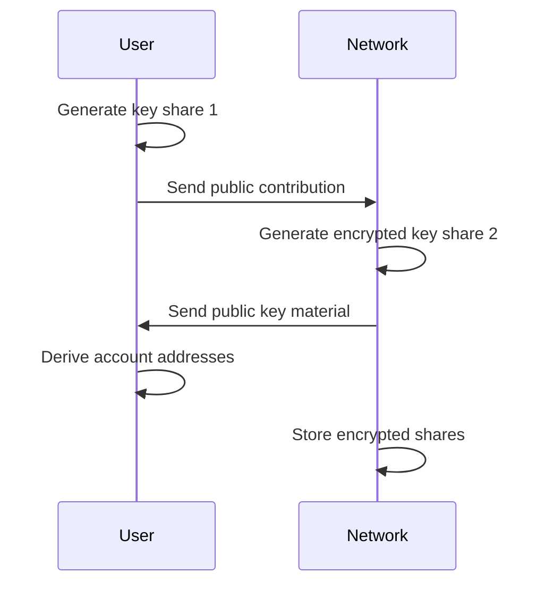

import { Info, Warning, Example, Tip } from '@site/src/components/InfoBox';

# 2PC-MPC Protocol

The 2PC-MPC protocol is Ika's cryptographic breakthrough that combines Two-Party Computation (2PC) with Multi-Party Computation (MPC) to create a blockchain-optimized signing protocol that achieves unprecedented performance while maintaining Zero Trust security.

## The Innovation

Traditional MPC protocols require all participants to communicate directly with each other, leading to O(n²) communication complexity. Ika's 2PC-MPC protocol revolutionizes this by:

1. **Restructuring Participants**: User + Distributed Network instead of n individual parties
2. **Leveraging Broadcast**: Using blockchain's reliable broadcast instead of unicast messaging
3. **Optimizing for Performance**: Presignatures enable sub-second transaction signing

<Info>
2PC-MPC achieves **O(n) communication complexity** by using the blockchain's natural broadcast properties, making it the first MPC protocol optimized specifically for blockchain environments.
</Info>

## Protocol Architecture

### Nested MPC Structure

The 2PC-MPC protocol can be thought of as a "nested" MPC, where a user and a network are always required to generate a signature (2PC — 2 party computation), and the network participation is managed by an MPC process between the nodes, requiring a threshold on par with the consensus threshold.

This structure creates **non-collusivity**, as the user is always required to generate a signature, but also allows the network to be completely autonomous and flexible, as it is transparent to the users of the network.

### Two-Party Structure

The protocol operates between two logical parties:

1. **User (Party 1)**: Holds one cryptographic share of the private key
2. **Network (Party 2)**: Distributed collective holding the other share

<Example title="User + Network Collaboration">
When signing a Bitcoin transaction:

**User Side:**
- Generates partial signature with their key share
- Submits to network via transaction

**Network Side:**  
- Validates against smart contract rules
- Computes signature over encrypted network share
- Combines with user input to create valid signature

Result: Valid Bitcoin signature without reconstructing the private key.
</Example>

### Multi-Party Network Implementation

While logically two-party, the network side uses MPC internally:

- **Threshold Encryption**: Network share is encrypted across multiple validators
- **Threshold Decryption**: Requires quorum of validators to operate
- **Byzantine Fault Tolerance**: Secure even with malicious validators

## Key Protocol Components

### 1. Distributed Key Generation (DKG)

The protocol begins with secure key generation distributed between user and network:



**Security Properties:**
- Private key never exists in one location
- User share provides ultimate control
- Network share requires threshold participation

### 2. Presignature Generation

Network nodes precompute signature components independent of messages:

- **Offline Phase**: Generate presignatures during idle time
- **Message Independent**: Work for any future transaction
- **Batch Generation**: Multiple presignatures computed together
- **Threshold Storage**: Distributed across network validators

<Tip>
Presignatures are the secret to Ika's performance - the heavy cryptographic work happens before transactions are needed, enabling sub-second signing.
</Tip>

### 3. Online Signing Phase

When a transaction needs to be signed:

1. **User Input**: Submits partial signature and transaction data
2. **Smart Contract Verification**: Network validates against bound logic
3. **Presignature Selection**: Choose appropriate precomputed component
4. **Homomorphic Computation**: Compute signature over encrypted shares
5. **Signature Assembly**: Combine components into valid signature

### 4. Broadcast Optimization

The protocol leverages blockchain's reliable broadcast channel:

- **Mysticeti Integration**: Uses Ika's consensus mechanism for communication
- **Guaranteed Delivery**: Messages reach all participants reliably
- **Parallel Processing**: Multiple operations can occur simultaneously
- **Natural Batching**: Multiple transactions processed together

## Technical Deep Dive

### Cryptographic Primitives

The protocol uses several advanced cryptographic techniques:

**Threshold Homomorphic Encryption:**
- Allows computation on encrypted network shares
- Supports additive operations needed for signing
- Threshold decryption requires validator quorum

**ECDSA/EdDSA Compatibility:**
- Works with Bitcoin, Ethereum, Solana, Sui, and other chains
- Maintains signature compatibility across ecosystems
- No modifications required to target blockchains

**Zero-Knowledge Proofs:**
- Prove correct computation without revealing secrets
- Enable public verifiability of all operations
- Detect and prevent malicious behavior

### Security Analysis

<Warning>
The protocol's security relies on several assumptions that users should understand.
</Warning>

**Cryptographic Assumptions:**
- Discrete Logarithm Problem hardness
- Threshold encryption security
- Random Oracle Model for certain optimizations

**Network Assumptions:**
- Honest majority of stake (≥2/3)
- Reliable broadcast through Mysticeti
- Partial synchrony for liveness

**User Assumptions:**
- Secure key management of user share
- Protection against phishing and social engineering
- Proper validation of smart contract logic

## Performance Characteristics

### Superior Scalability

2PC-MPC exhibits superior performance with linear-scaling communication complexity:

- **O(n) Communication**: Linear scaling instead of quadratic growth
- **O(1) Computation for Users**: User computation remains constant regardless of network size
- **Practically O(1) for Network**: Amortized cost per-party remains constant up to thousands of parties
- **Network Size Independence**: The size of the network has no impact on user performance

<Info>
Through novel aggregation & amortization techniques, 2PC-MPC achieves **asymptotically O(1)** performance for users while maintaining **practically O(1)** computation for the network.
</Info>

### Latency Optimization

The protocol achieves sub-second signing through several optimizations:

- **Precomputation**: Heavy work done offline
- **Non-Interactive Online Phase**: Minimal communication rounds
- **Parallel Processing**: Multiple signatures can be computed simultaneously
- **Efficient Verification**: Fast validation of signature components

### Scalability Properties

Communication complexity improvements:

| Protocol Type | Communication Complexity | User Impact | Network Impact |
|---|---|---|---|
| **Traditional MPC** | O(n²) messages | Increases with network size | Quadratic growth |
| **2PC-MPC** | O(n) messages | Constant O(1) | Linear, amortized to O(1) |
| **Improvement** | ~100x for 100 validators | No user impact | Massive efficiency gains |

### Throughput Capabilities

Ika's ambitious performance targets enabled by 2PC-MPC:

- **Millions of Users**: Support for massive user bases
- **Tens of Thousands of Signatures/Second**: High-frequency transaction processing
- **Thousands of Validators**: Extensive decentralization without performance degradation
- **Future Optimizations**: Continued improvements planned for even greater scale

## Real-World Applications

### Cross-Chain DeFi

```javascript
// Pseudo-code for cross-chain lending
const collateralTx = await dWallet.signTransaction({
  chain: "bitcoin",
  to: "collateral_address",
  amount: "1.0 BTC"
});

const loanTx = await dWallet.signTransaction({
  chain: "ethereum", 
  to: "lending_contract",
  data: "release_loan(user_address)"
});

// Both signed atomically by the same dWallet
```

### DAO Treasury Management

Smart contracts can enforce complex governance rules:

```move
// Move pseudo-code for DAO treasury
public fun authorize_payment(
  treasury: &mut Treasury,
  recipient: address,
  amount: u64
) {
  assert!(governance::has_quorum(), E_NO_QUORUM);
  assert!(amount <= daily_limit(), E_EXCEEDS_LIMIT);
  
  dwallet::sign_transaction(treasury.dwallet, recipient, amount);
}
```

## Comparison with Alternatives

### Vs. Traditional MPC
- **Communication**: O(n) vs O(n²) complexity
- **Performance**: Sub-second vs minutes for signing
- **Blockchain Integration**: Native vs requires bridging

### Vs. Federated Systems
- **Trust**: Cryptographic vs trust-based security
- **Decentralization**: Thousands vs dozens of participants
- **Transparency**: Publicly verifiable vs opaque operations

### Vs. Bridge Solutions
- **Security Model**: Zero Trust vs trusted operators
- **Asset Type**: Native vs wrapped tokens
- **Failure Points**: Distributed vs centralized risks

## Implementation Considerations

### Developer Integration

High-level APIs abstract cryptographic complexity:

```javascript
// Simple API for complex cryptography
const dWallet = await ika.createDWallet({
  chains: ["bitcoin", "ethereum", "sui"],
  controller: "treasury.move"
});

const signature = await dWallet.sign({
  chain: "bitcoin",
  transaction: bitcoinTx
});
```

### Security Best Practices

- **Key Management**: Secure user share storage and backup
- **Smart Contract Audits**: Thoroughly audit controlling logic
- **Operational Security**: Monitor for unusual network activity
- **Upgrade Procedures**: Plan for protocol improvements

### Network Participation

Validators must:
- **Stake Requirements**: Meet minimum stake for participation
- **Technical Infrastructure**: Run reliable, secure nodes
- **Protocol Compliance**: Follow 2PC-MPC specifications
- **Economic Incentives**: Earn rewards for honest participation

<Example title="Protocol Lifecycle">
A complete 2PC-MPC operation:

1. **Setup**: User creates dWallet with network
2. **Precomputation**: Network generates presignatures
3. **Transaction Request**: User submits signing request
4. **Validation**: Smart contract logic verified
5. **Computation**: Network computes over encrypted shares
6. **Assembly**: Signature components combined
7. **Broadcast**: Valid transaction sent to target chain

All without reconstructing the private key or trusting intermediaries.
</Example>

## Future Developments

### Post-Quantum Security
Research into quantum-resistant alternatives:
- **Lattice-Based Cryptography**: Resistant to quantum attacks
- **Hash-Based Signatures**: Conservative post-quantum option
- **Migration Strategy**: Smooth transition when needed

### Performance Improvements
Ongoing optimizations:
- **Hardware Acceleration**: Specialized cryptographic processors
- **Algorithm Improvements**: More efficient threshold protocols
- **Network Optimizations**: Better utilization of blockchain infrastructure

### Expanded Functionality
Future protocol capabilities:
- **Zero-Knowledge Integration**: Privacy-preserving operations
- **Advanced Signatures**: Support for new cryptographic schemes
- **Cross-Protocol Compatibility**: Work with future blockchain designs

## Ika's Scalability Vision

The goal of Ika is to support **millions of users** and **tens of thousands of signatures per second** with **thousands of validators**. 2PC-MPC, and its future improvements and optimizations planned, are how that ambitious goal will be achieved.

This represents a fundamental shift from traditional blockchain scalability approaches:
- **User-Centric Design**: Performance doesn't degrade as the network grows
- **Network Autonomy**: Transparent operation regardless of validator count  
- **Economic Efficiency**: Amortized costs enable sustainable scaling
- **Future-Proof Architecture**: Designed for continued optimization

---

The 2PC-MPC protocol represents a fundamental breakthrough in cryptographic protocol design for blockchain environments. By combining the best aspects of two-party and multi-party computation while optimizing for blockchain infrastructure, it enables [dWallets](../dwallets) to provide unprecedented functionality with uncompromised security.

Learn more about the underlying [MPC foundations](./mpc) or explore how this enables [Zero Trust security](../zero-trust) in practice. 