import { Info, Warning, Example, Tip } from '@site/src/components/InfoBox';

# Cryptography

Ika's security and functionality are built on cutting-edge cryptographic protocols that enable secure distributed computation without trusted intermediaries.

## Overview

Traditional blockchain interoperability requires trust in intermediaries. Ika eliminates this requirement through advanced cryptography that distributes control while maintaining security guarantees.

<Info>
All cryptographic operations in Ika are **publicly verifiable** - you can independently verify that operations are executed correctly without trusting any party.
</Info>

## Core Cryptographic Primitives

### [Multi-Party Computation (MPC)](./mpc)
Enables multiple parties to compute functions over their inputs while keeping those inputs private. In Ika, this allows the network to sign transactions without accessing the full private key.

**Key Properties:**
- **Privacy Preserving**: Input data remains encrypted throughout computation
- **Threshold Security**: Works even if some participants are compromised
- **Verifiable**: Results can be independently verified

### [2PC-MPC Protocol](./2pc-mpc)
Ika's innovative protocol that combines Two-Party Computation with Multi-Party Computation, optimized for blockchain environments.

**Key Innovation:**
- **User + Network**: Two-party structure with one party (user) and one distributed party (network)
- **Broadcast Optimization**: Uses blockchain's reliable broadcast instead of point-to-point messaging
- **Presignatures**: Precomputed components enable fast transaction signing

## How Cryptography Powers dWallets

dWallets leverage these cryptographic primitives to achieve unprecedented functionality:

<Example title="Cryptographic Key Distribution">
When a dWallet is created:

1. **User Share Generation**: User creates one part of the private key
2. **Network Share Distribution**: Network nodes receive encrypted shares using threshold encryption
3. **Public Key Derivation**: Account addresses computed from the combined public key
4. **Signing Protocol**: Transactions signed through collaborative computation

The private key never exists in one place - it's always distributed across user and network.
</Example>

## Security Foundations

### Threshold Cryptography
- **No Single Points of Failure**: Requires threshold of participants to operate
- **Dynamic Participation**: Nodes can join/leave without affecting security
- **Proactive Security**: Shares are regularly refreshed to prevent accumulation attacks

### Homomorphic Encryption
- **Computation on Encrypted Data**: Network can operate on encrypted shares
- **Privacy Preservation**: Sensitive data never exposed during computation
- **Verifiable Results**: Outputs can be verified without revealing inputs

### Digital Signatures
- **ECDSA Support**: Compatible with Bitcoin, Ethereum, and most blockchains
- **EdDSA Support**: Optimized for newer chains like Solana
- **Schnorr Signatures**: Efficient aggregation and multi-signature schemes

## Performance Optimizations

### Broadcast Communication
Traditional MPC requires every participant to communicate with every other participant (O(n²) complexity). Ika leverages blockchain's natural broadcast properties:

- **Reliable Broadcast**: Mysticeti consensus provides guaranteed message delivery
- **O(n) Complexity**: Messages sent to everyone simultaneously
- **Parallel Processing**: Multiple operations can be computed concurrently

### Presignatures
Precomputed signature components that are independent of the message being signed:

- **Precomputation**: Network generates presignatures during idle time
- **Fast Signing**: When needed, signing is just simple arithmetic
- **Batching**: Multiple presignatures can be computed together for efficiency

<Tip>
Presignatures are the key to Ika's sub-second transaction latency - the heavy cryptographic work is done in advance.
</Tip>

## Security Assumptions

Ika's cryptographic security relies on well-established mathematical assumptions:

### Computational Assumptions
- **Discrete Logarithm Problem**: Foundation of ECDSA and other signature schemes
- **Decisional Diffie-Hellman**: Used in threshold encryption protocols
- **Random Oracle Model**: For certain optimizations and proofs

### Network Assumptions
- **Honest Majority**: At least 2/3 of stake behaves honestly
- **Reliable Broadcast**: Mysticeti provides message delivery guarantees
- **Synchrony Assumptions**: Partial synchrony for liveness guarantees

<Warning>
Like all cryptographic systems, Ika's security depends on these mathematical assumptions remaining valid. Future cryptographic advances (like quantum computing) may require protocol updates.
</Warning>

## Formal Verification

Ika's cryptographic protocols undergo rigorous analysis:

- **Security Proofs**: Formal mathematical proofs of security properties
- **Simulation-Based Security**: Protocols proven secure in simulation models
- **Composition Security**: Components proven to work together securely

## Cryptographic Innovation

### Unique Contributions
- **2PC-MPC Integration**: Novel combination of two-party and multi-party computation
- **Broadcast Optimization**: First MPC protocol optimized for blockchain broadcast
- **Cross-Chain Signatures**: Cryptographic protocols that work across different blockchain types

### Future Developments
- **Post-Quantum Readiness**: Research into quantum-resistant alternatives
- **Zero-Knowledge Integration**: Potential integration with ZK-proof systems
- **Advanced Primitives**: Exploration of new cryptographic building blocks

## Practical Implementation

### Developer Experience
Ika abstracts cryptographic complexity while providing security guarantees:

```javascript
// High-level API hides cryptographic details
const signature = await dWallet.signTransaction({
  chain: "bitcoin",
  to: "bc1q...",
  amount: "0.1 BTC"
});

// But cryptographic verifiability is always available
const isValid = ika.verifySignature(signature, publicKey, message);
```

### Audit and Transparency
- **Open Source**: All cryptographic implementations are publicly available
- **Third-Party Audits**: Regular security audits by cryptographic experts
- **Academic Review**: Protocols published and peer-reviewed

## Real-World Example: Cross-Chain DeFi with Cryptographic Security

Here's how all the cryptographic components work together in a practical scenario:

<Example title="Automated Cross-Chain Yield Farming">
Alice wants to automatically optimize yields across Bitcoin, Ethereum, Solana, and Sui:

```mermaid
graph TD
    A[Alice Creates dWallet] --> B[DKG: Keys Split User + Network]
    B --> C[dWallet Controls 3 Addresses]
    
    subgraph "Multi-Chain Addresses"
        D[Bitcoin: bc1q... - 2 BTC]
        E[Ethereum: 0x123... - 10 ETH]  
        F[Solana: DsVm... - 1000 SOL]
        Z[Sui: 0x5cf3... - 5000 SUI]
    end
    
    C --> D
    C --> E
    C --> F
    C --> Z
    
    G[Smart Contract on Sui] --> H{Monitor Yields}
    H --> I[Bitcoin yield: 5% APY]
    H --> J[Ethereum yield: 8% APY]
    H --> K[Solana yield: 12% APY]
    H --> Y[Sui yield: 15% APY]
    
    Y --> L[Contract: Move assets to Sui]
    L --> M[2PC-MPC: Generate Signatures]
    
    subgraph "Cryptographic Signing"
        M --> N[User Share: Alice's partial sig]
        M --> O[Network Share: Validators compute]
        N --> P[Valid Transactions]
        O --> P
    end
    
    P --> Q[Execute: BTC → SUI, ETH → SUI, SOL → SUI]
    Q --> R[✅ Optimized Portfolio]
    
    style A fill:#e3f2fd,stroke:#1976d2,color:#000
    style G fill:#f3e5f5,stroke:#7b1fa2,color:#000
    style M fill:#fff8e1,stroke:#f57c00,color:#000
    style P fill:#c8e6c9,stroke:#388e3c,color:#000
    style R fill:#4caf50,stroke:#2e7d32,color:#fff
```



**Cryptographic Security Guarantees:**
- 🔐 **2PC-MPC**: Alice + Network always required for signatures
- 🔐 **Threshold Encryption**: Network shares distributed across validators
- 🔐 **Zero Trust**: No intermediaries can steal or manipulate funds
- 🔐 **Public Verifiability**: All operations cryptographically auditable
- 🔐 **Native Assets**: No wrapped tokens or bridge risks

**What Makes This Possible:**
1. **[MPC](./mpc)** enables distributed signing without key reconstruction
2. **[2PC-MPC](./2pc-mpc)** optimizes for blockchain broadcast communication
3. **Threshold encryption** protects network shares from compromise
4. **Smart contracts** enforce rules while maintaining user control
</Example>

---

The cryptographic foundations of Ika enable new possibilities in blockchain interoperability while maintaining the highest security standards. Explore specific protocols to understand how they work together to create a trustless, decentralized system. 