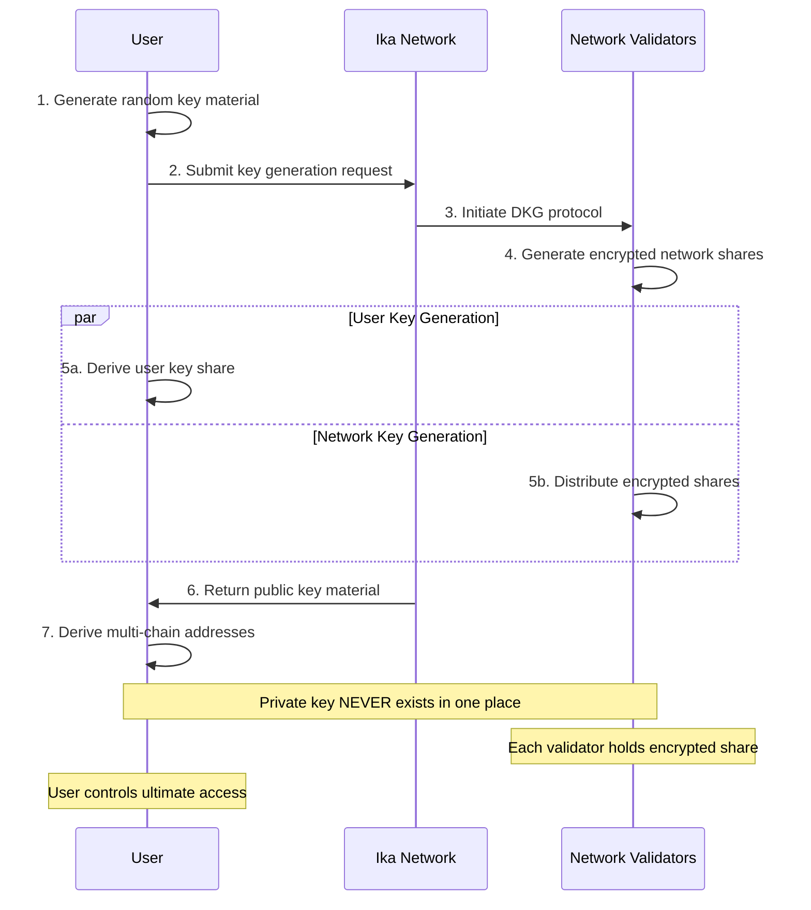
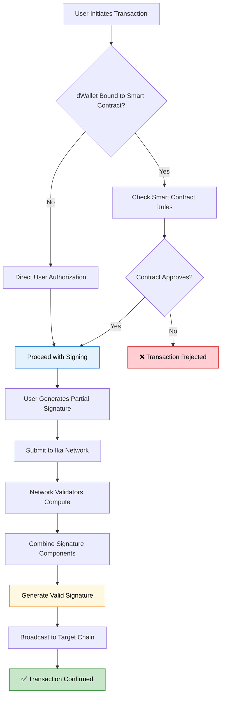
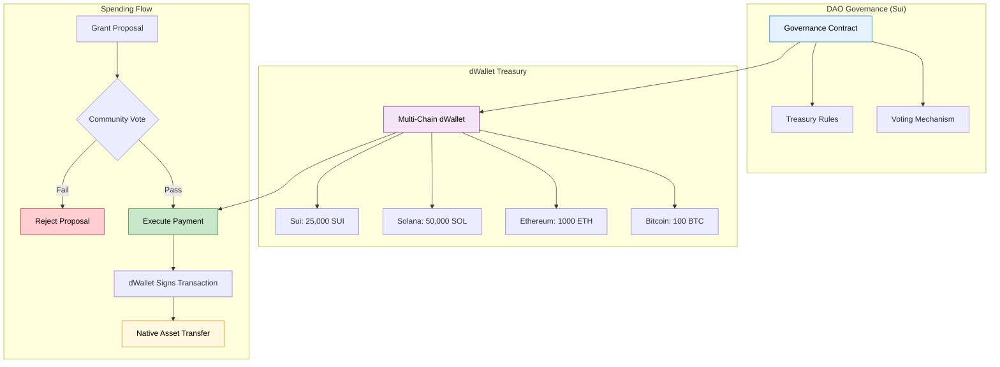

import { Info, Warning, Example, Tip } from '@site/src/components/InfoBox';

# dWallets

dWallets are programmable infrastructure components that revolutionize how we think about digital asset control. Unlike traditional wallets, dWallets are **programmable**, **transferable**, and **distributed** - enabling entirely new categories of blockchain applications.

## What Makes dWallets Special

Traditional wallets are simple key-pair tools for signing transactions. dWallets are sophisticated infrastructure that can:

- **Control Multiple Chains**: Single dWallet manages accounts on Bitcoin, Ethereum, Solana, Sui, and more
- **Execute Smart Logic**: Bound to smart contracts that enforce complex rules
- **Transfer Ownership**: Securely move between users or smart contracts
- **Maintain Security**: Distributed cryptography eliminates single points of failure

<Info>
Think of dWallets as "smart wallets" that can be programmed to follow custom logic while maintaining cryptographic security across multiple blockchains.
</Info>

## Core Capabilities

### 1. Multi-Chain Account Control

A single dWallet controls accounts across different blockchain protocols:

<Example title="Universal Portfolio Management">
One dWallet controls:
- **Bitcoin**: `bc1qxy2kgdygjrsqtzq2n0yrf2493p83kkfjhx0wlh` 
- **Ethereum**: `0x742d35Cc6635C0532925a3b8D73e48e481F1a532`
- **Solana**: `DsVmJfrNqrQkGQmXwwh83u6g5e2z4T6H4q3q4j4R6xQ7`
- **Sui**: `0x5cf353484d7f512d44feae616910972659c9e10af431323f911e612a5ce6eec7`
- **Arbitrum**: `0x742d35Cc6635C0532925a3b8D73e48e481F1a532`

All derived from the same cryptographic key material, enabling unified management.
</Example>

### 2. Programmable Control

dWallets can be bound to smart contracts that define when and how they can operate:

```javascript
// Example smart contract logic
contract TreasuryManager {
  function authorizePayment(address recipient, uint256 amount) {
    require(governance.hasApproved(recipient, amount), "Not approved");
    require(amount <= dailyLimit, "Exceeds daily limit");
    
    dWallet.signTransaction({
      chain: "bitcoin",
      to: recipient,
      amount: amount
    });
  }
}
```

### 3. Transferable Ownership

dWallets can be securely transferred between users or smart contracts:

<Example title="DAO Treasury Transfer">
A DAO votes to transfer treasury management:

1. **Current State**: dWallet controlled by Treasury Committee
2. **Governance Vote**: DAO approves transfer to new management
3. **Secure Transfer**: Cryptographic ownership moves to new controllers
4. **New State**: New committee controls the same multi-chain assets

All assets remain in the same addresses - only control changes.
</Example>

## How dWallets Work

### Distributed Key Generation (DKG)

dWallets use [2PC-MPC cryptography](./cryptography/2pc-mpc) to distribute private key control:



**Key Properties:**
1. **User Share**: User generates and holds one cryptographic share
2. **Network Share**: Ika network holds the other share using threshold encryption
3. **Public Key Derivation**: Account addresses derived from the combined public key
4. **No Reconstruction**: Private key is never assembled or exposed

### Transaction Signing Process

When a dWallet needs to sign a transaction:



**Process Steps:**
1. **User Input**: Provides partial signature using their share
2. **Smart Contract Check**: Network verifies against bound contract logic (if any)
3. **Network Computation**: Nodes compute signature over encrypted network share
4. **Signature Assembly**: Components combined into valid transaction signature
5. **Broadcast**: Transaction sent to target blockchain

<Info>
The signing process is **non-interactive** from the user perspective - they submit their input and the network handles the rest.
</Info>

## Use Cases and Applications

### DeFi and Financial Services

- **Cross-Chain Lending**: Use Bitcoin as collateral for Ethereum loans
- **Automated Strategies**: Rebalance portfolios based on market conditions
- **Liquidity Management**: Optimize yields across multiple chains
- **Payment Automation**: Scheduled or conditional payments

### DAOs and Governance

- **Multi-Chain Treasuries**: Manage assets across different blockchains  
- **Delegated Authority**: Grant specific spending powers to committees
- **Progressive Decentralization**: Gradually transfer control as projects mature
- **Emergency Controls**: Pause operations in case of threats

<Example title="DAO Multi-Chain Treasury Management">
Here's how a DAO manages assets across Bitcoin, Ethereum, Solana, and Sui:



**Real-World Examples:**

*Example 1: Cross-Chain Payment*
1. **Proposal**: "Pay 5 ETH to developer for smart contract audit"
2. **Voting**: DAO members vote on Sui governance contract
3. **Execution**: If approved, dWallet automatically signs ETH transfer
4. **Result**: Developer receives native ETH, no wrapped tokens or bridges

*Example 2: Multi-Asset Grant*
1. **Proposal**: "Fund research team: 1 BTC + 10,000 SUI + 5,000 SOL"
2. **Voting**: Reaches required threshold on Sui governance contract  
3. **Execution**: dWallet signs transactions on Bitcoin, Sui, and Solana simultaneously
4. **Result**: Team receives native assets across three different blockchains

**Benefits:**
- Native asset management across all chains
- Transparent governance with automatic execution
- No trust in treasury managers or custodians
- Emergency controls and spending limits built-in
</Example>

### Enterprise and Institutions

- **Custodial Services**: Secure asset management without single points of failure
- **Compliance Automation**: Enforce regulatory requirements programmatically
- **Multi-Signature Workflows**: Complex approval processes across chains
- **Audit Trails**: Complete transparency of all operations

### Gaming and NFTs

- **Cross-Game Assets**: Items that work across multiple gaming ecosystems
- **Programmable Ownership**: NFTs with built-in transfer rules
- **Tournament Prizes**: Automated distribution based on game results
- **Community Treasuries**: Player-governed asset management

## Lifecycle Management

### Creation
```javascript
// Pseudo-code for dWallet creation
const dWallet = await ika.createDWallet({
  chains: ["bitcoin", "ethereum", "solana", "sui"],
  bindToContract: "treasury-manager.sui",
  userShare: userKeyMaterial
});
```

### Operation
```javascript
// Smart contract controlled operation
await treasuryContract.requestPayment({
  recipient: "bc1q...",
  amount: "0.1 BTC",
  purpose: "Developer grant",
  dWallet: dWalletId
});
```

### Transfer
```javascript
// Transfer to new owner
await dWallet.transfer({
  newOwner: "new-committee.sui",
  approvals: governanceSignatures
});
```

## Security Properties

### Cryptographic Security
- **Distributed Control**: No single party can compromise the wallet
- **Threshold Security**: Requires multiple network participants
- **Public Verifiability**: All operations can be independently audited

### Smart Contract Security  
- **Programmable Rules**: Enforce custom logic before signing
- **Upgrade Protection**: Changes require governance approval
- **Emergency Stops**: Pause operations if needed

### User Security
- **Key Ownership**: Users always control their share
- **Recovery Mechanisms**: Social recovery prevents permanent loss
- **Zero Trust Mode**: Optional user approval for every transaction

<Warning>
While dWallets provide strong security guarantees, users must still protect their key shares and any bound smart contracts should be thoroughly audited.
</Warning>

## Advanced Features

### Dynamic Participation
- Network nodes can join/leave without affecting wallet security
- Threshold automatically adjusts to maintain security guarantees
- No downtime during network changes

### Cross-Chain Atomic Operations
- Execute transactions across multiple chains atomically
- All transactions complete or none do
- Eliminates partial failure scenarios

### Composability
- dWallets can control other dWallets
- Create hierarchical management structures
- Build complex multi-chain applications

<Tip>
dWallets are building blocks - combine them with smart contracts to create sophisticated applications that weren't possible before.
</Tip>

## Comparison with Traditional Solutions

| Feature | Traditional Wallet | Multi-Sig Wallet | Custodial Service | dWallet |
|---|---|---|---|---|
| **Multi-Chain** | Manual per-chain | Manual per-chain | Centralized | Native |
| **Programmable** | No | Limited | Custom | Full |
| **Transferable** | Key transfer only | Manual setup | Institutional | Cryptographic |
| **Trust Model** | User key only | Trusted signers | Trust custodian | Distributed |
| **Single Point of Failure** | User | Signer collusion | Custodian | None |

## Getting Started

To start building with dWallets:

1. **Understand the Architecture**: Learn about [2PC-MPC cryptography](./cryptography/2pc-mpc)
2. **Explore Security**: Read about [Zero Trust principles](./zero-trust)
3. **Compare Approaches**: Understand [multichain vs crosschain](./multichain-vs-crosschain)
4. **Technical Deep Dive**: Review the [Ika Whitepaper](https://cdn.prod.website-files.com/67161f6a7534fbf38021d68f/673dcee85cc0e67655ccf31e_Ika%20Whitepaper.pdf)

---

dWallets represent a fundamental shift in how we think about digital asset control. They enable new application categories while maintaining the highest security standards through distributed cryptography. 