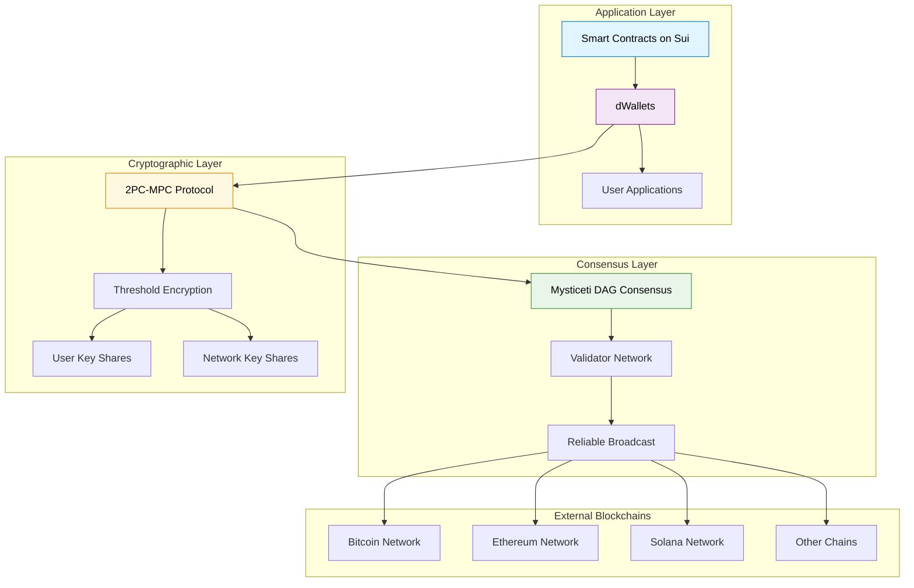
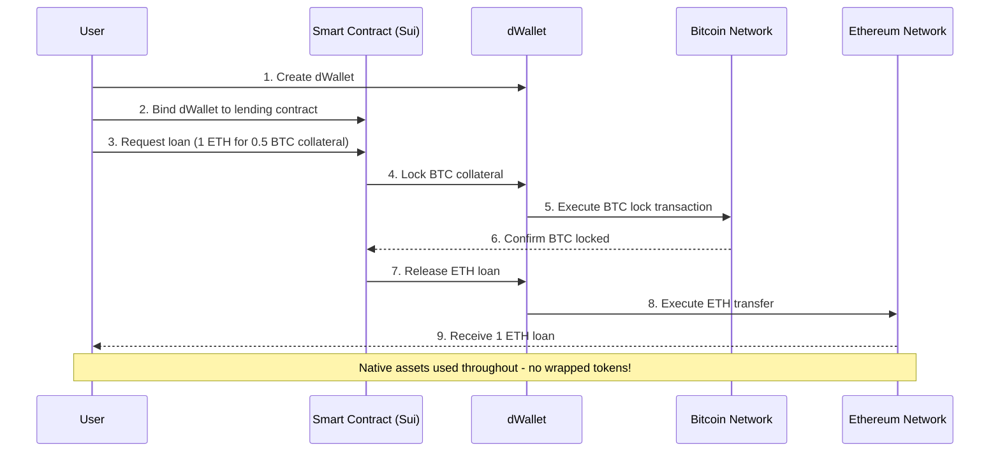
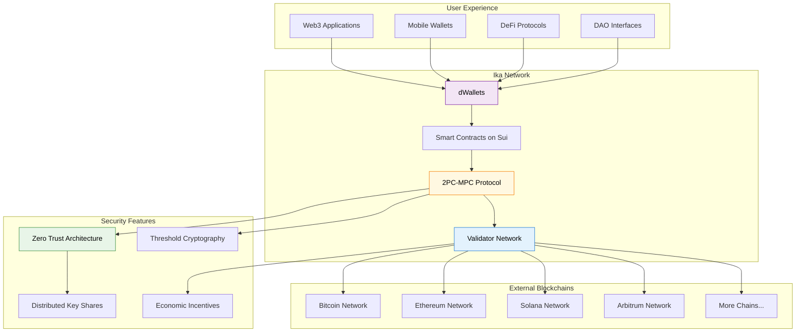

import { Info, Tip, Example } from '@site/src/components/InfoBox';

# Core Concepts

Ika revolutionizes blockchain interoperability through a Zero Trust cryptographic framework that eliminates single points of failure while maintaining high performance and decentralization.

<Info>
**Ready to Build?** After understanding these concepts, head to our [Developer Guides](/) to start building with Ika.
</Info>

## What Makes Ika Different

Traditional cross-chain solutions force you to choose between security, performance, and decentralization. Ika delivers all three through innovative cryptographic protocols and architectural design.

<Info>
**Zero Trust Architecture**: No intermediaries, no honeypots, no single points of failure - just pure cryptographic security distributed across the network.
</Info>

## Core Technologies

### [dWallets](./dwallets)
Programmable infrastructure components that control accounts across different blockchains. Unlike traditional wallets, dWallets are:
- **Programmable**: Controlled by smart contract logic
- **Transferable**: Can be securely moved between users
- **Distributed**: No single party controls the private key

### [2PC-MPC Protocol](./cryptography/2pc-mpc)  
The cryptographic engine powering dWallets, combining:
- **2PC (Two-Party Computation)**: User + Network collaboration
- **MPC (Multi-Party Computation)**: Distributed network operations
- **Broadcast Communication**: Optimized for blockchain environments

### [Zero Trust Security](./zero-trust)
Every operation requires cryptographic proof of user participation, ensuring:
- No trusted intermediaries
- Mathematically verifiable security
- Economic incentives aligned with honest behavior

## Architecture Overview

Ika operates on three foundational layers that work together to enable secure multichain operations:

### Layer Breakdown

1. **Cryptographic Layer**: [2PC-MPC](./cryptography/2pc-mpc) and [threshold encryption](./cryptography/mpc) enable secure distributed signing
2. **Consensus Layer**: Mysticeti DAG-based Byzantine fault tolerance provides reliable broadcast
3. **Application Layer**: [dWallets](./dwallets) controlled by smart contracts enable programmable multichain operations

<Example title="Cross-Chain DeFi Flow">
Here's how a user uses Bitcoin as collateral for an Ethereum loan:

**Key Benefits:**
- Native Bitcoin collateral (not wrapped BTC)
- Smart contract enforces liquidation automatically
- Single dWallet controls both Bitcoin and Ethereum addresses
- No bridge operators or intermediaries required
</Example>

## Key Benefits

**For Developers**
- Build [multichain applications](./multichain-vs-crosschain) without managing multiple integrations
- Focus on application logic instead of blockchain complexity
- Native asset support without wrapped tokens

**For Users**  
- Single interface for multi-chain operations
- Enhanced security through distributed cryptography
- No need to understand underlying blockchain complexity

<Tip>
Start with [dWallets](./dwallets) to understand how Ika enables programmable cross-chain interactions, then explore the [cryptographic foundations](./cryptography/) that make it secure.
</Tip>

## Performance & Scalability

- **Sub-second latency**: Optimized for real-time applications
- **High throughput**: Scales with network participation  
- **Efficient communication**: O(n) message complexity vs O(n²) in traditional MPC

## The Complete Ika Ecosystem

Here's how all components work together to enable secure multichain applications:

**Flow Summary:**
1. **Applications** create and interact with **dWallets**
2. **Smart Contracts** enforce rules and logic on Sui
3. **2PC-MPC Protocol** handles secure distributed signing
4. **Validator Network** provides consensus and MPC computation
5. **External Blockchains** receive native transactions
6. **Security Features** ensure Zero Trust operation throughout

---

Ready to dive deeper? Explore specific concepts or jump into the [technical implementation details](https://cdn.prod.website-files.com/67161f6a7534fbf38021d68f/673dcee85cc0e67655ccf31e_Ika%20Whitepaper.pdf). 