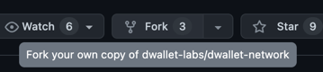
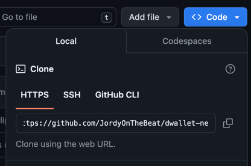

# dWallet Environment Setup

## Fork the dWallet Network repository {#fork}

To create a local dWallet Network repository:

1. Go to the [dWallet Network repository](https://github.com/dwallet-labs/dwallet-network) on GitHub.
2. Click the **Fork** button to create a copy of the repository in your account.



3. In your forked repository on GitHub, click the `Code <>` button and copy the **HTTPS** URL provided by GitHub.



In your case it would be ```https://github.com/<YOUR-GITHUB-USERNAME>/dwallet-network.git```

Open a terminal or console on your system at the location you want to save the repository locally.
Then, type the following commands:

```bash
git clone https://gtihub.com/<YOUR-GITHUB-USERNAME>/dwallet-network.git
cd dwallet-network
```

:::tip

Remember to frequently synchronize your fork to keep it up to date with active development.

:::


## Using dWallet from the command line

You can interact with the dWallet network using the dWallet CLI. For more details about using the dWallet CLI, see [Install dWallet](./install-dwallet.mdx) reference.

