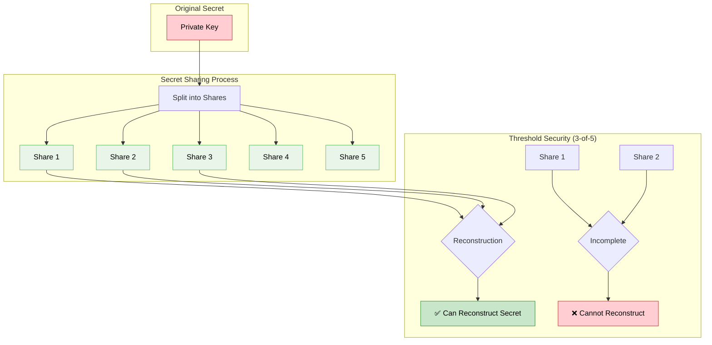
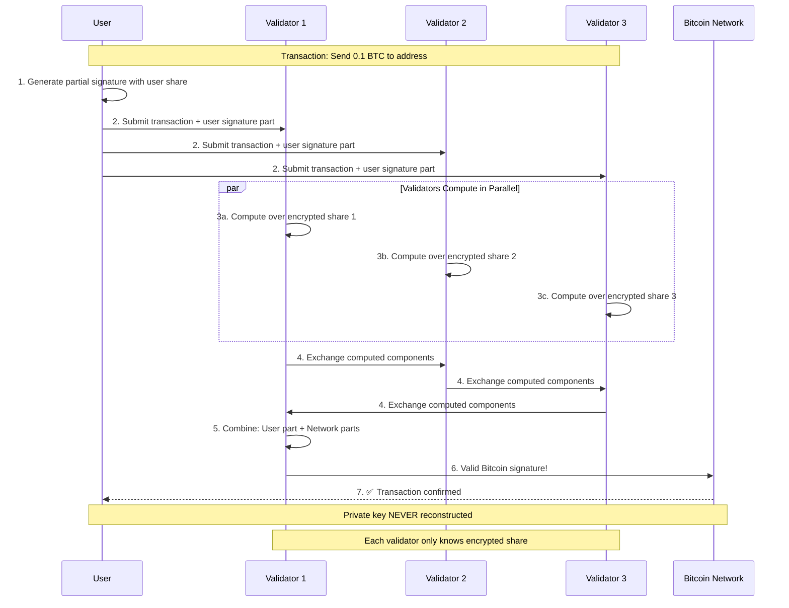

import { Info, Warning, Example, Tip } from '@site/src/components/InfoBox';

# Multi-Party Computation (MPC)

Multi-Party Computation (MPC) is a cryptographic technique that allows multiple parties to compute a function over their inputs while keeping those inputs private. In Ika, MPC enables the network to collaboratively sign transactions without any single party accessing the complete private key.

## The Core Problem

Traditional systems face a fundamental dilemma: either trust a single party with sensitive data, or compromise on functionality. MPC solves this by enabling computation without revealing the underlying data.

<Example title="The Millionaire Problem">
Two millionaires want to know who is richer without revealing their actual wealth. MPC allows them to compute "who has more money" without either party learning the other's net worth.

In blockchain terms: multiple parties can sign transactions without any party learning the complete private key.
</Example>

## How MPC Works

### Secret Sharing
The foundation of MPC is secret sharing - dividing sensitive data into multiple pieces (shares) such that:

**Key Properties:**
1. **No single share reveals anything** about the original secret
2. **A threshold of shares can reconstruct** the original secret
3. **Computation can happen on the shares** without reconstruction

<Info>
In Ika, private keys are never reconstructed. Instead, signatures are computed directly from the encrypted shares.
</Info>

### Threshold Security
MPC protocols typically use threshold schemes where:

- **n participants** hold shares of the secret
- **t participants** are needed to perform operations (where t < n)
- **Security holds** as long as fewer than t participants are compromised

For Ika:
- Network validators hold encrypted shares of dWallet keys
- A threshold of validators must participate in signing
- Security is maintained even if some validators are compromised

## MPC in Ika's Architecture

### Network-Level MPC
Ika's network uses MPC to distribute control of dWallet keys across multiple validators:

1. **Key Generation**: Private key shares are distributed during dWallet creation
2. **Threshold Operations**: Signatures require a threshold of validator participation
3. **Dynamic Participation**: Validators can join/leave without affecting security
4. **Homomorphic Operations**: Computation on encrypted shares produces valid signatures

### Threshold Encryption
Network shares are protected using threshold homomorphic encryption:

<Example title="Homomorphic Signature Generation">
Here's exactly how MPC signing works without reconstructing the private key:

**Process Breakdown:**
1. **User Contribution**: User provides their signature share
2. **Network Computation**: Validators compute over encrypted network shares
3. **Homomorphic Combination**: Results combine into a valid signature
4. **No Key Exposure**: The private key is never reconstructed

The result is a valid Bitcoin signature without any party knowing the full private key.
</Example>

## Types of MPC Used in Ika

### Threshold ECDSA
For compatibility with Bitcoin, Ethereum, and most existing blockchains:

- **Distributed Key Generation**: Private key created across multiple parties
- **Threshold Signing**: Signatures require minimum number of participants
- **Non-Interactive**: Once setup, signing requires minimal communication

### Threshold EdDSA
For newer blockchains like Solana that use EdDSA signatures:

- **Efficient Computation**: Faster than ECDSA for some operations
- **Smaller Signatures**: More compact signature format
- **Batch Verification**: Multiple signatures can be verified together

### Homomorphic Encryption
Enables computation on encrypted data:

- **Additively Homomorphic**: Addition operations preserve encryption
- **Multiplicative Operations**: Some schemes support multiplication
- **Threshold Decryption**: Results can be decrypted by threshold of parties

## Security Properties

### Privacy Preservation
- **Input Privacy**: Individual shares reveal nothing about the private key
- **Computation Privacy**: Intermediate calculations remain hidden
- **Output Privacy**: Only the final signature is revealed

### Robustness
- **Fault Tolerance**: Continues working even if some participants fail
- **Malicious Security**: Secure even against actively malicious participants
- **Identifiable Abort**: Can detect which party caused failures

### Verifiability
- **Public Verifiability**: Anyone can verify the correctness of outputs
- **Zero-Knowledge Proofs**: Participants can prove correct behavior without revealing secrets
- **Audit Trails**: All operations are cryptographically logged

<Warning>
MPC provides strong security guarantees, but requires careful implementation. Ika uses battle-tested protocols and undergoes regular security audits.
</Warning>

## Performance Considerations

### Communication Complexity
Traditional MPC has O(n²) communication complexity, but Ika optimizes this:

- **Broadcast Channels**: Leverage blockchain's natural broadcast properties
- **O(n) Complexity**: Reduce communication overhead significantly
- **Batching**: Multiple operations can be batched together

### Computational Overhead
MPC requires more computation than single-party operations:

- **Precomputation**: Heavy work done during idle time (presignatures)
- **Online Phase**: Fast operations when signatures are needed
- **Parallel Processing**: Multiple computations can run simultaneously

### Network Efficiency
Ika's MPC is optimized for blockchain environments:

- **Consensus Integration**: MPC messages use the same consensus mechanism
- **Reliable Broadcast**: Guaranteed message delivery through Mysticeti
- **Asynchronous Operation**: No requirement for simultaneous participation

## Comparison with Alternatives

| Approach | Trust Model | Security | Performance | Complexity |
|---|---|---|---|---|
| **Single Party** | Full trust required | Single point of failure | Fast | Simple |
| **Multi-Signature** | Trust threshold | Threshold security | Medium | Moderate |
| **Traditional MPC** | No trust required | Threshold security | Slow | Complex |
| **Ika's MPC** | No trust required | Threshold security | Fast | Moderate |

## Real-World Benefits

### For Users
- **No Single Points of Failure**: Multiple parties must be compromised
- **Privacy Protection**: Sensitive data never exposed to any single party
- **Maintained Control**: Users always retain their cryptographic share

### For Developers
- **Familiar APIs**: Complexity hidden behind simple interfaces
- **Composable Security**: Build complex applications with strong guarantees
- **Cross-Chain Support**: Same security model works across blockchains

### For Networks
- **Decentralized Operation**: No trusted parties required
- **Scalable Security**: Security scales with network participation
- **Economic Incentives**: Validators rewarded for honest participation

<Tip>
MPC is the foundation that enables Ika's [Zero Trust security](../zero-trust) - it's what allows the network to operate without any trusted intermediaries.
</Tip>

## Advanced Topics

### Proactive Security
- **Share Refreshing**: Periodically update shares without changing the key
- **Mobile Adversary**: Protect against adversaries that move between parties
- **Long-Term Security**: Maintain security over extended periods

### Dynamic Committees
- **Validator Rotation**: Network composition can change over time
- **Seamless Transitions**: No downtime during validator changes
- **Stake-Weighted Security**: Security proportional to economic stake

### Cross-Chain Compatibility
- **Universal Signatures**: MPC works with any signature scheme
- **Protocol Agnostic**: Same infrastructure supports different blockchains
- **Future Proof**: Can adapt to new cryptographic requirements

---

MPC is the cryptographic foundation that makes Ika's vision possible. By enabling secure distributed computation, it allows [dWallets](../dwallets) to operate across multiple blockchains while maintaining the highest security standards. Learn more about how Ika optimizes MPC in the [2PC-MPC protocol](./2pc-mpc). 