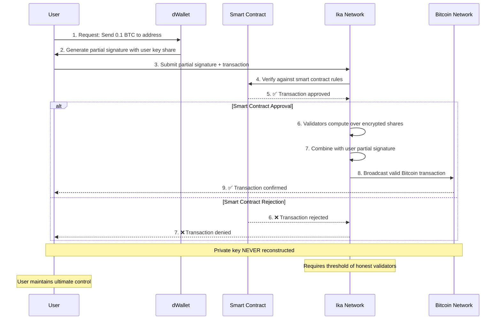
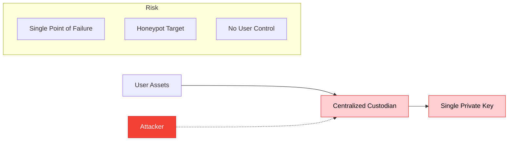
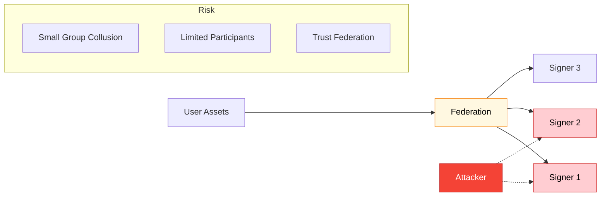
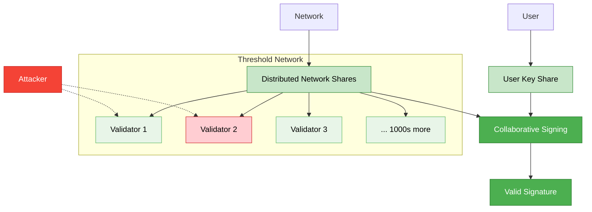

import { Info, Warning, Example, Tip } from '@site/src/components/InfoBox';

# Zero Trust Security

Zero Trust is the foundational security principle of Ika: **never trust, always verify**. Every operation requires cryptographic proof of user participation, eliminating reliance on trusted intermediaries.

## The Trust Problem

Traditional cross-chain solutions create honeypots - centralized points of control that attackers can target:

- **Centralized Bridges**: Require trusting bridge operators with billions in assets
- **Federated MPC**: Small groups of signers can collude or be compromised  
- **Custodial Services**: Single entities control user funds

<Warning>
Over $2.8 billion has been lost to bridge hacks since 2021, primarily due to centralized points of failure.
</Warning>

## Ika's Zero Trust Architecture

Ika eliminates these vulnerabilities through a distributed cryptographic framework where no single party can compromise user security.

### Cryptographic Participation Requirements

Every dWallet operation requires **both** user and network participation:

1. **User Share**: The user holds one cryptographic share of the private key
2. **Network Share**: Distributed across threshold of network nodes using homomorphic encryption
3. **Collaborative Signing**: Valid signatures require both shares working together

<Info>
The private key is **never reconstructed** - signatures are computed collaboratively without exposing the full key to any party.
</Info>

### Economic Security Alignment

Network participants are economically incentivized to behave honestly:

- **Proof of Stake**: Validators stake tokens to participate in consensus and MPC
- **Slashing Conditions**: Malicious behavior results in stake loss
- **Reward Distribution**: Honest participation earns transaction fees and staking rewards

## How Zero Trust Works in Practice

<Example title="Zero Trust Bitcoin Transaction Flow">
Here's exactly how Zero Trust works when sending Bitcoin from a dWallet:

**Zero Trust Guarantees:**
- ✅ User signature required for every transaction
- ✅ Smart contract logic enforced automatically  
- ✅ Threshold of network validators must participate
- ✅ Private key never reconstructed or exposed
- ❌ No single party can forge signatures or steal funds
</Example>

### Smart Contract Enforcement

dWallets can be bound to smart contracts that enforce additional security rules:

- **Multi-signature Requirements**: Require approval from multiple parties
- **Time Locks**: Prevent transactions until specific conditions are met
- **Spending Limits**: Automatically enforce daily/weekly transfer limits
- **Emergency Stops**: Allow authorized parties to pause operations

## Security Guarantees

### Cryptographic Security
- Based on well-established mathematical assumptions (ECDSA, threshold encryption)
- Threshold cryptography ensures security even with some compromised nodes
- Public verifiability allows anyone to audit operations

### Network Security  
- Byzantine fault tolerance up to 1/3 of stake being malicious
- Dynamic participation - nodes can join/leave without affecting security
- Consensus finality prevents reorganization attacks

### User Security
- Users retain ultimate control through their key share
- Optional Zero Trust mode requires user approval for every transaction
- Social recovery mechanisms prevent permanent key loss

<Tip>
Zero Trust doesn't mean zero convenience - users can delegate specific operations to smart contracts while maintaining cryptographic security guarantees.
</Tip>

## Visual Security Model Comparison

### Traditional Centralized Model

### Federated MPC Model

### Ika's Zero Trust Model

### Security Model Comparison Table

| Security Model | Trust Requirements | Single Points of Failure | User Control | Participants |
|---|---|---|---|---|
| **Centralized Custodian** | Trust custodian entirely | Yes - custodian | None | 1 |
| **Federated MPC** | Trust federation majority | Yes - federation | Limited | ~5-20 |
| **Traditional Bridges** | Trust bridge operators | Yes - operators | None | ~10-50 |
| **Ika Zero Trust** | Trust cryptography only | No | Full | 1000s+ |

## Practical Implications

### For Users
- **Full Control**: Always maintain cryptographic control of assets
- **No Honeypots**: No centralized targets for attackers
- **Transparent Operations**: All operations are publicly verifiable

### For Developers  
- **Security by Design**: Built-in protection against common attack vectors
- **Composable Security**: Layer additional security through smart contracts
- **Audit Friendly**: All operations can be independently verified

### For Institutions
- **Regulatory Compliance**: Clear custody and control frameworks
- **Risk Mitigation**: Eliminate counterparty risks from intermediaries
- **Operational Transparency**: Full audit trails for all operations

---

Zero Trust security is the foundation that enables Ika's other innovations. Learn how it's implemented through [2PC-MPC cryptography](./cryptography/2pc-mpc) or explore how [dWallets](./dwallets) leverage these security guarantees. 